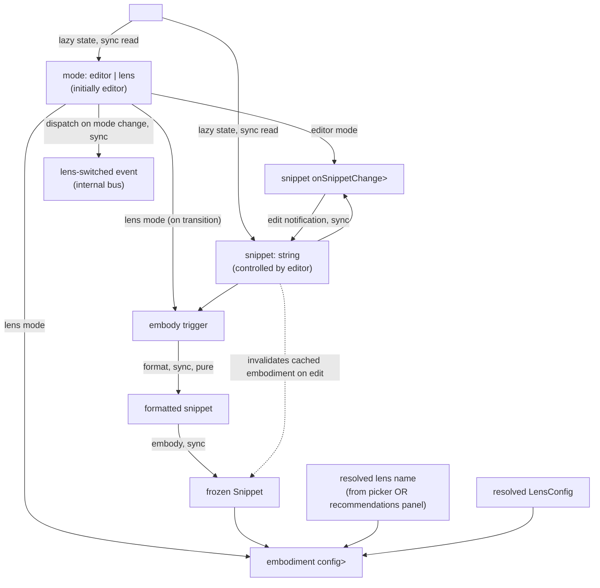
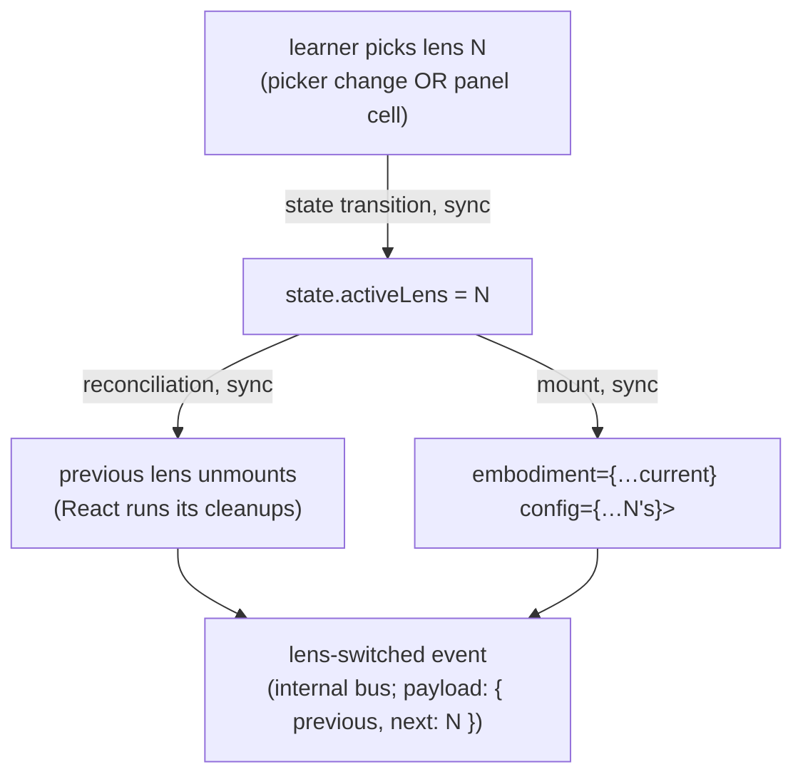

# orchestrator — Architecture & Decisions

## Why this module exists

`compose/orchestrator/` is the **React seam** between the package's
pure-TS substrate (`embody/`, `compose/lib/*`) and the rendered
learner experience. It exports `<StudyLenses>` — the package's
public API. Concentrating the React wiring in one directory keeps
every other module pure TypeScript: testable in vitest without
`jsdom`, runnable in node-only contexts, free of React-as-dependency
creep.

The orchestrator owns:

- The `<StudyLenses>` component itself (mode state, embody trigger,
  lens dispatch).
- The toolbar lens-picker (Q-I always-on surface).
- The recommendations panel UI shell (Q-II auto-generated paths;
  Q-III ranking-overrides extend it via WS3 increments L7/L8 once
  WS2 ships them; Q-IV deferred entirely). The engine lives in
  `compose/lib/recommender/`, owned by WS2.
- The editor-vs-lens state machine + the lazy-embodiment trigger
  policy.
- The internal EventBus (intra-component coordination only).

> **Prior art**:
> [`../../study-lenses/orchestrator/DOCS.md`](../../study-lenses/orchestrator/DOCS.md)
> documents the pre-refactor effect topology, Switch flow Mermaid,
> and async caveat. Structural patterns carry forward; specific
> mechanisms (cache, framework-agnostic LensMount, multi-prop API,
> always-active lens mount, transforms tier) reshape per the
> locked decisions in
> [`../../README.md` § Pedagogical first principles](../../README.md#pedagogical-first-principles).

## Architectural sketch

> Written Phase 0, before implementation. The Refactor step of each
> increment in
> [`../../.planning-handoffs/03-orchestrator-and-contracts.md`](../../.planning-handoffs/03-orchestrator-and-contracts.md)
> is held against this sketch. Domain terms only — no function
> names, no variable names, no pseudocode (React API names like
> `useEffect` / `useState` / `useRef` are acceptable as
> structural-mechanism references).

### Lifecycle modes

The orchestrator's UI is in exactly one of two modes at a time
(per `03-orchestrator-and-contracts.md` F2):

```mermaid
stateDiagram-v2
    [*] --> EditorMode: initial mount
    EditorMode --> LensMode: learner opens a lens<br/>(picker selection OR panel selection)
    LensMode --> EditorMode: learner exits lens
    LensMode --> LensMode: learner switches to a different lens<br/>(reuses current embodiment;<br/>previous lens unmounts)
    EditorMode --> EditorMode: learner edits snippet<br/>(no embodiment built yet)
    LensMode --> [*]: component unmount
    EditorMode --> [*]: component unmount
```

- **Editor mode** — `compose/editor/` is mounted; learner is
  editing the snippet string. **No active lens, no embodiment.**
  Picker is visible.
- **Lens mode** — a lens is active with a frozen embodiment + lens
  config bundle as React props. Snippet is read-only while in
  lens mode. Switching lenses reuses the current embodiment;
  previous lens unmounts; new lens mounts fresh.

The mode switch from editor → lens is the moment the snippet is
snapshotted. Returning editor → lens later (after edits) builds a
NEW embodiment.

### Data flow (full lifecycle)

Failure modes:

- **Format / validate / parse error at embody trigger** — surfaces
  in lens mode at the moment the trigger fires (lens-open from
  editor). Lens receives an embodiment with `status.parsed=false`
  (or equivalent gates) and displays per its own error-surface
  contract. NOT surfaced while typing.
- **Evaluation error inside a lens** — surfaces only when the
  lens's evaluation triggers (run / predict button), even if
  detectable statically. Per lens's own error-surface contract.
- **Async setup inside a lens** — async resource loading (e.g.
  CodeMirror language modules) lives inside the lens's React
  component, not in the embody trigger. The orchestrator's
  embody trigger is **sync** by contract: format → embody →
  cache. If a future evaluation engine needs async embody, that
  contract change re-opens this section; until then, sync.

### Switch flow (lens-mode internal)

When already in lens mode and the learner picks a different lens
via the picker or panel:

Snippet does NOT change during a lens-mode switch — same
embodiment is fed to the new lens. The previous lens's
in-progress UI state (parsons shuffle, blanks fills) is gone (per
disposability). The new lens's `LensModule.Component` mounts
fresh; if it does async setup, it manages that internally.

The `lens-switched` event fires INTERNALLY (no outbound emit). The
picker re-renders to reflect the new default-selected option.

### Effect topology

Three categories of `useEffect` in the orchestrator
(post-refactor; specific deps and ordering pin during F1's Phase 0):

| Category              | Triggers on                           | What it does                                                                                | Cleanup                                              |
| --------------------- | ------------------------------------- | ------------------------------------------------------------------------------------------- | ---------------------------------------------------- |
| **Embody trigger**    | mode → lens transition                | Format pre-process → `embody(snippet)` → cache embodiment in state                           | None — embodiment is plain frozen data               |
| **Lens-switch dispatch** | `state.activeLens` change while in lens mode | Fire `lens-switched` (payload `{ previous, next }`) on the internal bus                  | None                                                 |
| **Embodiment-on-edit invalidation** | snippet change while in editor mode | Discard cached embodiment; next lens-open builds a fresh one                       | None                                                 |

What's NOT in the topology (vs the pre-refactor design):

- ~~`mountActiveLens`~~ — React reconciles components by tree
  position; no manual mount/detach.
- ~~`disposeOnUnmount` cleanup orchestrating `mount.dispose()` for
  every cached lens~~ — no cache; each lens's own `useEffect`
  cleanups run when React unmounts it.
- ~~`onSnippetChanged` IoC dispatch to cached mounts~~ — no cache;
  no in-place propagation. React unmounts the lens; the next
  embodiment props feed a fresh mount.

### Internal event taxonomy (sketch)

The internal EventBus carries intra-component coordination events.
Specific payloads pin during F1/F5; the sketched roster:

| Event              | Fires on                                  | Implemented in | Notes                                                                          |
| ------------------ | ----------------------------------------- | -------------- | ------------------------------------------------------------------------------ |
| `lens-switched`    | active-lens transition (lens-mode switch) | F5             | Payload: `{ previous: string \| null, next: string }`. Picker re-render trigger. |
| `mode-changed`     | editor ↔ lens mode transition             | F5             | Payload: `{ from: 'editor' \| 'lens', to: 'editor' \| 'lens' }`. May fold into above. |
| `exercise-completed` | lens fires its own completion signal    | future         | Lens-internal; orchestrator forwards. Shape per-lens, opaque to orchestrator.   |
| `lens-mount-error` | lens throws during mount or async setup   | future         | Surfaces lens errors to the orchestrator's error UI.                            |

The taxonomy is **internal-only**: no `subscribe` / `onEvent` prop
on `<StudyLenses>` until a concrete LMS integration target appears
(per F5). When that target appears, the externalized protocol can
be a curated subset of these.

### Structural constraints

- **Public surface is one component**: `<StudyLenses>`. Three
  optional props (`snippet`, `lens?`, `config?`). Everything else
  internal.
- **Single-writer state**: only `compose/editor/` mutates the
  snippet. The orchestrator threads the editor's
  `onSnippetChange` callback into its state-update.
- **Editor mode vs lens mode** is a 2-state machine. There is no
  concurrent "editor + lens" rendering.
- **Lazy embodiment**: built on lens-open (mode transition) or on
  evaluation-trigger inside an active lens. Never on every
  keystroke.
- **Disposable practice**: snippet edits invalidate any cached
  embodiment AND trigger React unmount of the active lens (when
  re-entering lens mode against the new snippet, a fresh lens
  mount happens with the new embodiment).
- **Internal EventBus only**: no outbound `subscribe` /
  `onEvent` prop on `<StudyLenses>` until a concrete LMS
  integration target appears.
- **Picker always visible**: the toolbar lens-picker dropdown is
  shown in BOTH editor mode and lens mode — it's the Q-I
  autonomy guarantee.
- **Recommendations panel is opt-in UI**: opens via toolbar
  button or keyboard shortcut. Not always visible; not modal.
- **Async caveat carries forward**: any `useEffect` body that
  awaits a Promise (async embody, async lens setup) creates a
  microtask gap between effect-fire and side-effect-completion.
  Subscribers to `lens-switched` that need the new mount in the
  DOM should defer their work to a microtask or
  `requestAnimationFrame` (per
  `study-lenses/orchestrator/DOCS.md` § Phase 2 step 4).

### Out of scope

- **Embodiment construction details** — owned by
  [`../../embody/`](../../embody/). The orchestrator just calls
  `embody(snippet)` and consumes the returned `Snippet`.
- **Lens internals** — owned by [`../../lenses/`](../../lenses/).
  The orchestrator passes `embodiment` + `config` props; what the
  lens does inside is its own concern.
- **Recommender engine** — owned by
  [`../lib/recommender/`](../lib/recommender/) (WS2). The
  orchestrator's panel UI consumes the engine's output; it does
  not re-rank.
- **Editor implementation** — owned by [`../editor/`](../editor/).
  The orchestrator threads its callback prop and renders it in
  editor mode.
- **Per-snippet manual study tours (Q-IV)** — DEFERRED per
  `03-orchestrator-and-contracts.md` § Layer IV.

## Why two-mode state machine (vs always-active)

The pre-refactor design always had a lens mounted (the editor
lens was the default). When the learner edited code, the editor
lens absorbed the edits via its own UI; other lenses (parsons,
blanks) reacted via `onSnippetChanged`.

The new architecture's editor-vs-lens split makes the editing-
vs-exercising boundary explicit:

- In editor mode, the learner is **authoring** code — the editor
  is the focus; no lens is active; no embodiment is built.
- In lens mode, the learner is **exercising** an embodiment —
  the snippet is frozen; the lens is the focus.

Benefits:

- **Simpler state.** No "editor lens edits while parsons lens
  shuffles" concurrency. One mode at a time, one clear focus.
- **Lazy embodiment is natural.** Building embodiments only at
  mode transition matches what the learner expects: typing is
  cheap; opening an exercise costs an embody.
- **Disposability is structural.** Snippet edits in editor mode
  don't disturb any lens — there is no lens. The next lens-open
  builds a fresh embodiment.

The cost is a UX nuance: the learner can't type code WHILE
watching parsons shuffle reorder. Per the locked
disposable-practice decision and the Explorotron framing, this
is the intended pedagogical model: practice surfaces (lenses)
are distinct from authoring surfaces (editor); switching modes
is an explicit pedagogical commitment.

## Why three-effect topology (vs Inc-9's three-effect topology)

The pre-refactor Inc-9 design had three named effects:
`disposeOnUnmount`, `mountActiveLens`, `dispatchSwitch`. The new
topology has three categories that look different but solve the
same problems:

- **Inc-9 `disposeOnUnmount`** managed cache disposal on real
  unmount. Replaced by **per-lens-React-cleanup** — each lens's
  `useEffect` cleanups run when React unmounts it. No central
  registry to clean up.
- **Inc-9 `mountActiveLens`** managed the framework-agnostic
  mount lifecycle (attach/detach `mount.el` to host ref). Replaced
  by **React reconciliation** — the orchestrator just renders
  `<LensModule.Component>` and React handles the rest.
- **Inc-9 `dispatchSwitch`** fired `lens-switched` events.
  Survives as the **lens-switch dispatch** category in the new
  topology.

Two new categories appear:

- **Embody trigger** — replaces what used to happen inside the
  pre-refactor `mountActiveLens` body (validate + execute pipeline
  + lens.lens). Embody centralizes the substrate calls.
- **Embodiment-on-edit invalidation** — new because the
  pre-refactor design always had an active embodiment. Lazy
  embodiment requires explicit invalidation when the snippet
  changes.

## Module ownership

This module owns the React seam, the toolbar UI, the panel UI,
the orchestrator-internal types, and the **lens registry**
(open-spec: likely a static import-list of `LensModule` defaults;
F4 Phase 0 settles whether it stays an import-list or grows a
runtime `register()` API). It does NOT own:

- The substrate it wraps — `embody/`, `lenses/`, `compose/lib/*`
  (with WS2 owning recommender + analysis).
- The home-base editor at [`../editor/`](../editor/).
- The Docusaurus plugin's prop emission — lives outside the
  package at `src/plugins/study-lenses/`.

## Future direction

- The async-embody affordance (loading state during
  embody-on-trigger) lands in F3 Phase 0. Sketch only — pin during
  F3 implementation.
- The picker + panel coexistence visual design (overlapping?
  side-by-side? modal panel?) lands during L5's Phase 0 sandbox
  checkpoint.
- Outbound LMS event protocol — designed when a concrete
  integration target appears. The internal EventBus is the
  wire-tap point.
