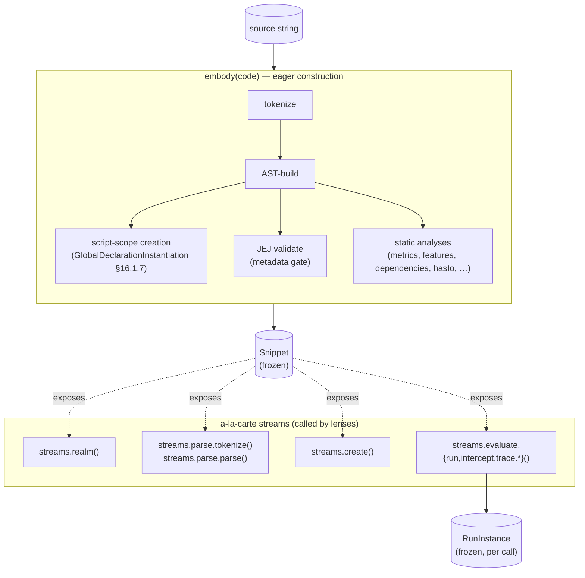

# embody — Architecture & Decisions

This module operationalizes the [JEJ Notional Machine](../notional-machine.md)
as a frozen-data + event-stream contract. The conceptual model is upstream
of the data; this document captures **why the data is shaped the way it
is** and the tradeoffs we considered before locking the contract in
[`types.ts`](./types.ts).

## Data flow

A JEJ source string flows through embody as follows. Static analyses on
the left-hand side are computed eagerly during construction. Lifecycle
event streams on the right-hand side are invoked a-la-carte by lenses.

Status booleans (`tokenized`, `parsed`, `created`) gate which streams /
fields are exposed; lenses guard by checking the relevant boolean before
reaching for fields. See [`types.ts`](./types.ts) for the full contract.

## Why this design

### Pure data, no methods

Every embody surface is data: frozen objects, primitives, arrays.
Generators are the only callable surface (event streams are inherently
iterated). No `query()`, `dispose()`, `clone*()`, no accessor methods,
no derived getters. Anything a lens "needs to do" is spelled out as
iteration + filter over the data.

Why: pedagogy depends on observability. If a lens has to call methods to
reach state, lenses fork into "API users" instead of "data readers." Pure
data means lenses are diff-able, predictable, and trivial to mock for
tests.

### Strict immutability via single deep-freeze

Built mutably during construction (so cross-references can be wired up),
deep-frozen once at the end. No clone-on-access. No closure-backed getters
that hide computation. Frozen objects are safely shareable.

LLM agents (and human collaborators) cannot trust each other not to mutate
returned data. The freeze is a hard guarantee, not a politeness.

### No Maps or Sets at the public surface

`Object.freeze` doesn't freeze Maps or Sets — `frozenObj.someMap.clear()`
silently succeeds. Pedagogy also prefers ground-truth shapes: indexes are
plain `Record<K, V>`, sequences are arrays. Lenses build their own Maps
internally if they want O(1) lookup.

### Per-instance, no shared state

No module-level cache, no cross-instance communication. One `embody(code)`
knows nothing of others. Multiple lenses on the same snippet hold their
own embody instance. (We considered caching deterministic runs; declined
as not worth the complexity for small JEJ programs — see "No evaluate
caching" below.)

### Status booleans, not a discriminated union

Field availability follows the parse-create staircase: tokenize success
unlocks parse, parse success unlocks creation, creation success unlocks
evaluate. We considered modeling this as a TypeScript discriminated union
(`status: 'tokenize-failed' | 'ast-failed' | 'create-failed' | 'ok'`)
but the user preferred independent boolean gates — each is data, no
ceremony to narrow. Lenses guard by `if (snippet.status.parsed) …`.

### Snowball event tiers as filter whitelists

Evaluate-side tiers (`run`, `intercept`, `trace.syntax`, `trace.semantics`)
are not type-narrowed subsets — they are **filter predicates** over a
single flat `Event` discriminated union. Higher tiers strictly include
more event categories. `run` is special: returns a RunInstance with
`events: []` (no event tier).

This avoids the modeling smell of "run ⊂ intercept" being false (run
emits no events at all). The flat union with filter whitelists is honest:
one universe, several views.

### Single static AST shared across runs

Each `evaluate.*` call produces a frozen `RunInstance` whose events
reference the **same single static AST** (snippet.parse.ast) by identity
(`event.node === astNode`). No per-run AST clone. RunInstance carries
run-specific state (events, endReport, finalEnvironment, runMetrics),
plus a back-reference to the snippet for static data.

We considered cloning the AST per run with events attached (matching
intercept's existing pattern). Declined: the clone cost is real, and a
simple `events.filter(e => e.node === node)` covers the lookup ergonomics
without the clone.

### Environment is derivable, not an event

There is no `category: 'environment'` event type. The environment at any
step is derivable by folding `category: 'scope'` (push/pop) and
`category: 'binding'` (declare/initialize/access/update) events from
`static.initialScope` forward. The environment is the substrate other
events happen *in*, not a thing that happens.

Lenses building "memory diagram at step N" fold the deltas; they don't
need a snapshot event. This is more parsimonious and avoids
double-counting state.

### No evaluate-call caching

Each `evaluate.*` call re-runs the worker. JEJ programs are small, runs
are cheap, and cache machinery (mock identity tracking, WeakMap edge
cases, stale-cache confusion) costs more than it saves. Lenses that want
a stable replay hold onto a RunInstance themselves.

### Doubly-linked event refs (data, not OOP)

Events form a doubly-linked list of plain frozen objects with `prev` /
`next` references — same pattern as
`lib/evaluating/intercept`'s `LinkedInterceptEvent`. Lenses can walk by
index (array) or by sequence (linked refs) without arithmetic. Not OOP
nodes — just data with object cross-references.

## `embody/lib/*` integration

embody composes outputs from sibling `embody/lib/*` modules
(`parse/`, `ast/`, `validating/`, `formatting/`, `evaluating/`,
`scope/`) into one entwined frozen graph. The lib modules return
raw (unfrozen, unvalidated) data; embody validates the composition
and applies the single deep-freeze at the entwined-graph boundary.
This keeps lib outputs freely composable and freeze a hard
guarantee at the public seam.

Static-side stream generators (`streams.realm`,
`streams.parse.tokenize`, `streams.parse.parse`, `streams.create`)
yield event-wrapped views over pre-computed event arrays cached on
the snippet — generators emit from the cached array rather than
recomputing.

## Spec correspondence

embody is **ECMAScript-spec-aligned**. Every type and event in
[`types.ts`](./types.ts) corresponds to an NM concept which corresponds
to an ECMA-262 abstract operation:

| embody | NM concept | ES2024 op |
| --- | --- | --- |
| `Realm` | Realm setup | `InitializeHostDefinedRealm` (§9.6) |
| `Realm.intrinsics` | ECMA intrinsics | `SetDefaultGlobalBindings` (§9.3.4) |
| `Realm.host` | Host bindings | HTML host hook |
| `ParseGraph` | Parse output | `ParseScript` (§16.1.5) |
| `InitialScope` | Creation phase | `GlobalDeclarationInstantiation` (§16.1.7) |
| `RunInstance` | Evaluation | `ScriptEvaluation` (§16.1.6) + per-Block `BlockDeclarationInstantiation` (§14.2.3) |
| `BindingStatus = 'tdz'` | Uninitialized binding | §9.1.1.1.1 |
| `CoerceEvent kind` | ToPrimitive / ToString / ToNumeric / ToBoolean | §7.1 |

See `../notional-machine.md` § Spec correspondence appendix for the full
mapping including JEJ-pedagogical splits, glossary bridges, and known
imperfections.

## Archive

`.legacy/` holds pre-DDD sketches (plann.txt, plann.excalidraw.svg,
parse-phase-error-categorization.js) — superseded by the locked design,
kept for archival reference only.

## Open holes in the contract

The contract intentionally leaves the following parts unspecified.
Each gap is a deliberate choice — locking these would foreclose
options that consumers' real use is needed to inform.

- **RunInstance entwinement details** — the contract names
  `events`, `node` references, and `prev/next` linked-list shape
  but does not specify their exact relationship or any derived
  indexes. The shape concretizes when consumers' access patterns
  on the `LinkedInterceptEvent` + `InterceptResult` surface make
  the right indexing visible.
- **Per-category event payloads** — the kinds within each category
  (`expression: 'literal' | 'identifier' | …`, `coerce: 'ToPrimitive' |
  'ToString' | …`, etc.) are named in [`types.ts`](./types.ts);
  the full payload shape per kind is intentionally open so
  per-category emission detail is not premature.
- **`Distribution` shape for `metrics`** — currently `{ min, max,
  mean, median, samples }`. The contract leaves open whether
  `samples` exposes raw arrays or pre-computed stats only — which
  one wins depends on what lens consumption actually requires.
- **`HasIo` per-method counts vs. only sums** — the contract
  exposes per-method counts with convenience totals. The split
  is open: it may collapse to sums-only if lens consumption
  doesn't require per-method detail.
- **`features` enumeration** — the boolean record of
  language-feature usage is intentionally non-exhaustive. Lenses
  pull what they need; the record extends rather than commits to
  a closed list.
- **`lib/*` `_meta` shape** — currently `{ freeze?: boolean }`.
  Open for additional internal-only flags as the internal
  contract evolves.
