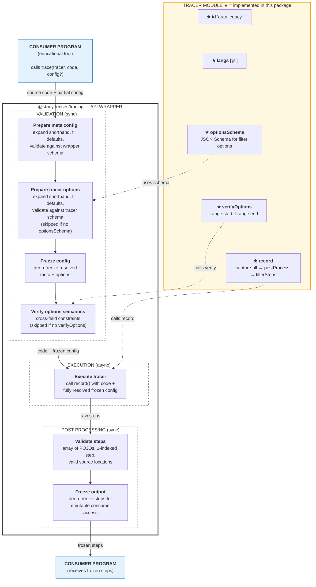

# evaluating/trace — Architecture & Decisions

## Why this tracer exists

Wraps the legacy Aran instrumentation engine — originally built for the
HackYourFuture Study Lenses project — in the standard `TracerModule` contract
from `@study-lenses/tracing`.

Instruments JavaScript source code via Aran AST weaving, capturing every
expression evaluation, variable access, function call, and control-flow step.
Executes instrumented code in a disposable Web Worker for isolation and timeout
safety. Returns structured, frozen `AranStep[]` conforming to `StepCore`.

Exists as a separate package so the legacy Aran engine can be used alongside
other `@study-lenses` tracers (e.g. the KLVE tracer) through the same API.

## Architecture

```text
code (string)
  → record/record.ts       ← pipeline orchestration
  → record/trace.ts        ← spawns module worker, handles timeout + SAB I/O
  → record/trace-worker.ts ← Vite-bundled worker entry, runs legacy tracer
  → legacy-aran-trace/     ← Aran instrumentation (vendored, environment-agnostic)
  → post-process.ts        ← raw entries → structured AranStep[]
  → filter-steps.ts        ← post-trace filtering → frozen AranStep[]
```

`src/index.ts` is wire-up only — no logic. All tracer logic lives in `record/`.

### Module boundaries

The ESLint `boundaries` plugin (`eslint.boundaries.mjs`) enforces a DAG:

- `record/` is the tracer core — can import from shared utilities
- `verify-options/` can use shared utilities but NOT `record/` (avoids coupling
  validation to engine types)
- `index.ts` (entry) assembles everything — the only file that imports across
  all modules

### Execution model: Web Worker + SAB+Atomics

The legacy Aran tracer originally ran in an iframe (shared main-thread event
loop). This meant synchronous infinite loops froze the entire page with no
recovery. The current architecture uses a disposable Web Worker:

- **Isolation**: each trace call spawns a fresh module worker. The worker's
  globalThis is the sandbox — no iframe needed.
- **Timeout**: `worker.terminate()` kills runaway code after `maxSeconds`.
  Partial trace entries captured before termination are preserved.
- **Synchronous I/O**: `prompt()`, `confirm()`, `alert()` use SAB+Atomics.
  The worker blocks on `Atomics.wait()` while the main thread shows the native
  dialog and writes the response to the SharedArrayBuffer.
- **Per-step streaming**: each ADVICE trap calls `print()`, which postMessages
  the entry to the main thread immediately. The main thread accumulates entries.
  On timeout, all entries received so far are available for debugging.

This mirrors the pattern in `evaluating/run/` but uses a Vite-bundled module
worker (not a blob URL) because the Aran tracer is ~500KB of ESM code. This
creates a build-time dependency on Vite's worker handling.

**Invariant**: Workers MUST NOT be reused across trace calls. Each `trace()`
spawns a new worker and terminates it on completion or timeout. The worker's
globalThis is polluted by Aran setup and learner code — reuse would leak state.

**Worker initialization sequence** (order matters):

1. Define `globalThis.prompt/confirm/alert` as SAB-blocking traps
2. Import and run aran-build.js (sets `globalThis.Aran/Acorn/Astring`)
3. Run Aran setup (`aran.setup()` → captures `ADVICE.builtins.global`, including
   the prompt/confirm/alert traps defined in step 1)
4. Execute instrumented code

If steps 1 and 2-3 are reordered, prompt/confirm/alert will either be undefined
(workers have no native dialog APIs) or bypass SAB trapping.

**Per-step streaming tradeoff**: each print() call triggers a postMessage, which
is O(n) structured-clone overhead for large traces. This is intentional — it
preserves partial traces on timeout (critical for debugging infinite loops).
Batching can be added later if performance is a concern.

### Pipeline



## Key decisions

### Engine choice

The legacy Aran tracer — an eval-based instrumentation engine originally built
for the HackYourFuture Study Lenses project. Chosen for backward compatibility.
The engine is vendored in `record/legacy-aran-trace/` with minimal modifications
to make it environment-agnostic (globalThis instead of window, guarded Element
checks). The instrumentation pipeline (parse → walk → weave → generate) is pure
JS; only `trace.js` and `trace-log.js` were modified to remove DOM dependency.

Alternatives considered: Babel-based AST instrumentation (more control but
higher maintenance), native debugger protocol (not browser-portable).

### Error mapping

Syntax errors (creation phase) and runtime errors (execution phase) are captured
inside the worker and returned as entries — never thrown. The main-thread
orchestrator (`trace.ts`) wraps these into the standard error types:

- `ParseError` — Acorn parse failure (creation phase)
- `RuntimeError` — uncaught exception during eval (execution phase)
- `LimitExceededError` — `worker.terminate()` fired after `maxSeconds`

### Step format

The legacy tracer emits `RawEntry` objects with string-encoded operation info in
the `prefix` field (e.g. `"declare (const): x"`, `"binary: +"`), plus
`>>>`/`<<<` string markers for scope boundaries.

`postProcess` regex-parses these into structured `AranStep` objects with typed
fields: `operation`, `name`, `operator`, `modifier`, `values`, `depth`,
`scopeType`, `nodeType`, `loc`. Source locations are shallow-copied to plain
POJOs (Aran AST nodes may carry prototype chains). Steps are unnumbered at this
stage.

`filterSteps` applies user options, then assigns 1-indexed `step` numbers to
survivors.

### Options design

Uses **JSON Schema + `verifyOptions`**:

- `options.schema.json` — defines structure, types, and defaults for all filter
  options
- `verifyOptions` — enforces the cross-field constraint
  `range.start <= range.end`

Both are needed because JSON Schema handles structural validation and
default-filling well, but cannot express cross-field constraints.

Filtering is **post-trace** (not pre-trace) because the legacy tracer uses a
mutable singleton `config.js` to control instrumentation. Rather than threading
filter options through legacy code, `record.ts` temporarily overrides all config
flags to "capture everything", then filters structured output post-hoc.

## Why an AsyncGenerator

Same rationale as `evaluating/run/` — the trace engine needs to produce events
incrementally for live UI rendering (per-AST-node granularity) while supporting
batch consumption. The generator is wrapped by `createExecution` at the `api/`
layer.

The trace Worker pauses after each `postMessage` via the SAB pause flag (same
protocol as run). The generator's `next()` resumes it. This gives the consumer
full control over pacing — essential for step-by-step visualization.

## Why a streaming processor alongside batch

The existing `postProcess` and `filterSteps` functions work on completed arrays.
The streaming processor (`createStreamingProcessor`) processes entries one at a
time as they arrive from the Worker.

Both paths exist because:

- **Streaming**: used by the generator engine for live event delivery. Maintains
  incremental state (depth counter, scope stack, 1-element pending buffer for
  evaluate merge).
- **Batch**: used by the legacy `@study-lenses/tracing` wrapper for backward
  compatibility. Also serves as the reference implementation for cross-testing.

Both paths import from the same `parsers/` and `filters/` modules, ensuring
identical processing logic.

## Why extract parsers and filters into separate files

`postProcess` and `filterSteps` were monolithic files with multiple inline
functions. Extracting into `parsers/` and `filters/` directories:

- Makes each function independently testable
- Enables sharing between batch and streaming paths
- Follows the codebase convention of one default export per file
- Simplifies each file to a single responsibility

The batch orchestrators (`postProcess`, `filterSteps`) remain as thin
orchestration layers that import from these directories.

## Iteration-based stopping in the streaming processor

The streaming processor counts loop-entry events per source location (dictionary
keyed by `loc.start.line:loc.start.column`). When any loop exceeds
`config.iterations`, the processor triggers the cancel callback, which
terminates the Worker.

This is different from the run engine's approach (AST-injected counters) because
the trace engine cannot modify the code — Aran instruments the original AST, and
injecting counter code would interfere with the instrumentation. Instead,
iteration limits are enforced by counting observed events in the streaming
processor.

Loop exit events reset the counter for that source location (handles nested
loops that re-enter).

## What this package deliberately does NOT do

- **Make pedagogical decisions** — returns raw trace data; presentation is the
  consumer's job
- **Persist or accumulate traces** — each call is stateless

## trace-action wrapper

`trace-action.ts` wraps the existing tracer with language-level validation and
`allow`/`block` feature configuration. It:

1. Resolves the `allow`/`block` config to a narrowed `LanguageLevel`
2. Validates source code against that level (throws if invalid)
3. Delegates to the existing `record()` function
4. Returns frozen `AranStep[]`

Enforcement is not applied because the legacy tracer runs in its own sandboxed
worker. Validation is the gate.

### Why Vite-bundled module worker (not blob URL)

`evaluating/run` uses a blob URL worker (~3KB). The trace worker requires ~500KB
of legacy Aran code (aran-build.js + all ADVICE modules + support modules), all
written as ESM with import/export. A blob URL would require either:

- Manually stripping all ESM syntax (fragile, hard to maintain)
- Inlining 500KB+ into a template string (impractical)

A Vite-bundled module worker (`new Worker(url, { type: 'module' })`) lets all
legacy modules import normally. Vite handles bundling and tree-shaking at build
time.
