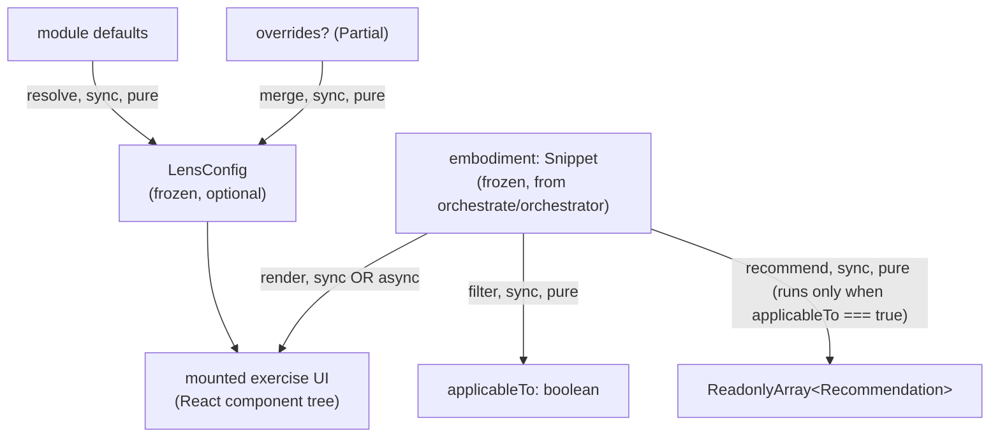

# lenses — Architecture & Decisions

## Why this peer exists

`lenses/` is the bounded context for the **stateful "mini web app"
plugins** that turn a frozen [`embodiment`](../embody/types.ts)
(`Snippet`) into an interactive learning exercise. Each lens
embodies a computing-education-research-backed pedagogical
intervention (parsons, blanks, trace-table, highlight, …) per the
package's TCER Phase 4 framing in [`../README.md`](../README.md)
§ Study lenses.

Concentrating all lens implementations under one peer (instead of
threading them through the orchestrator) means:

- The orchestrator never imports a specific lens. It depends only
  on the registered set, looked up by name through the lens
  registry the WS2 recommender ranks against.
- Adding a lens is one subdirectory (`lenses/<name>/`) plus a
  registration step (planned: a static enumeration in
  `orchestrate/`). Replacing a lens is a same-path
  same-shape swap.
- Lens authors ship plugins that the orchestrator mounts; they
  never reach into `embody/` (top) or `orchestrate/` (top) — they
  receive `embodiment` via React props.

Lens modules are intentionally **two-layer**: a pure-TS core (no
React) plus a light React wrapper (the `Component` field of the
exported [`LensModule`](./types.ts)). This preserves testability —
the core is testable in vitest without `jsdom`; the wrapper is
testable with `@testing-library/react`.

## Architectural sketch

> Written Phase 0, before implementation. The Refactor step of each
> lens's Phase 1 is held against this sketch. Domain terms only;
> no function names, no variable names, no pseudocode.

### Lens-API surfaces

Each lens exports a `LensModule` whose three callable fields are
synchronous and pure. The orchestrator and recommender consume
these without instantiating the React component:

1. **Resolve config** — `config(overrides?)` merges optional
   `LensConfig` overrides over module defaults and returns a frozen
   `LensConfig`. Hashable — no callbacks, no class instances.
2. **Filter** — `applicableTo(embodiment)` returns `boolean`. The
   WS2 recommender's applicability filter calls this to gate which
   lenses are even considered. Fast pure check; no I/O, no side
   effects.
3. **Recommend** — `recommend(embodiment)` consumes the frozen
   `Snippet` and returns zero or more `Recommendation` objects placed
   on the 3D Block Model grid. Independent of mount; called only when
   the recommendations panel opens. Runs only on lenses that already
   passed `applicableTo`. Analysis is internal to
   `orchestrate/lib/recommender/`; there is no separate
   `AnalysisReport` hand-off type lenses consume.

### Mount lifecycle

A separate concern from the API surfaces above: when the
orchestrator chooses a lens, it renders `<LensModule.Component
embodiment={…} config={…} />`. From the lens's perspective:

- **Mount** (React-driven) — React reconciles; the component
  instantiates the lens's TS core internally.
- **Optional async setup** — if the lens needs to dynamically
  load resources (e.g. CodeMirror language modules), it does so
  inside its component via `useEffect` + state machine OR
  `React.lazy` + `<Suspense>`. The LensModule surface itself stays
  synchronous; the React component absorbs all async.
- **UI ready** — the lens renders the exercise interaction surface
  for the learner.
- **Unmount** — React unmounts when the snippet changes (the
  orchestrator re-embodies and remounts) OR when the learner
  switches lenses OR exits to editor mode. Cleanup is per-lens
  (its own `useEffect` cleanups run); no central registry.

### Data flow

The diagram is per-lens. The orchestrator (upstream) supplies
`embodiment` and `config`; the recommender (sibling) calls
`applicableTo` and `recommend` to surface the lens. The exercise
UI is what the learner interacts with — its internal state
(parsons shuffle, blanks fills) is React-managed and per-mount.

### Structural constraints

- **Read-only views.** Lenses MUST NOT mutate the snippet. The
  only writer of snippet state is [`orchestrate/editor/`](../orchestrate/editor/).
- **Disposable practice.** Lens-internal UI state is per-mount
  only. When the snippet changes (re-embody), React unmounts the
  lens. Do NOT reach for `localStorage`, refs across mounts, or
  module-level state to persist exercise progress. Cross-edit
  state is the LMS's job (per `../README.md` § Pedagogical first
  principles, scope-boundary).
- **Two-layer module shape.** Each lens at `lenses/<name>/` lives
  across (at least) two files: a pure-TS core and a React wrapper.
  The wrapper exports the LensModule's `Component` field. Tests
  split similarly: `tests/core.test.ts` (no jsdom),
  `tests/component.test.tsx` (jsdom + @testing-library/react).
- **`embodiment` parameter name** wherever a function takes a
  Snippet instance (LensProps, applicableTo, recommend).
- **Self-describing for the recommender.** Each lens's
  `applicableTo` and `recommend` are the only inputs the WS2
  recommender's applicability filter and ranking engine consume to
  rank the lens. The orchestrator never reaches inside a lens to
  introspect its capabilities.
- **Async permitted, but bounded.** Lenses needing async setup
  handle it inside the React Component (Suspense or effect-based
  loading). The LensModule contract surface stays synchronous.
- **Lens-internal `LensConfig`.** A lens may define its own
  config-shape narrowing in its local `types.ts`; the public
  surface stays the open `Readonly<Record<string,
  SerializableValue>>`. Config hashability is the load-bearing
  constraint — primitives + primitive arrays only, no callbacks.
- **Transforms are lens-internal, not a peer concept.** The
  pre-refactor `transforms/` peer module was deleted in Round-2.
  There is no shared "transform pipeline" between lenses + the
  orchestrator: each lens decides what visual / pre-eval
  transformations to apply to the snippet it received (formatting
  toolbar buttons, the `loopGuard` rewrite a tracing lens applies
  before evaluation, the `parsons` lens's line shuffler — each
  lives inside the lens that uses them, not in a shared peer).
  Composition between lenses is opt-in: a lens that wants format-
  before-display can import a small format helper out of
  `orchestrate/lib/*` or `@-utils`, but it does not declare a
  `transforms` field on its `LensModule` and the plugin does not
  emit a `transforms` attribute.
- **No consumer-side sentinel branching on `embody` mock outputs.**
  During Phase A, `embody(code)` is a mock dispatched by sentinel
  comments (e.g. `/* MOCK_OK */`, `/* MOCK_PARSE_FAIL */`). Lens
  code MUST NOT inspect the input string for sentinels; branch only
  on the **shape** of the returned `Snippet` (e.g.
  `embodiment.parsed === false`, `embodiment.validation.isJeJ`).
  The sentinels disappear in Phase B; consumer code that branched
  on them would silently break. See
  [`../embody/index.ts`](../embody/index.ts) JSDoc + the
  `EMBODY_MOCK_SCENARIOS` export for the full scenario list.
- **Validation field derivation is fixed.** The `Snippet.validation`
  fields `isDeterministic` and `doesPause` are **derived** from the
  raw analyses on construction:
  `isDeterministic = !any(nonDeterminism)`,
  `doesPause = hasIo.user.total > 0`. Lens authors treat these as
  read-only summaries; the underlying source of truth lives on
  `nonDeterminism` and `hasIo`. Pinned in
  [`../embody/types.ts`](../embody/types.ts) JSDoc.

### Out of scope

- **Cross-lens communication.** Lenses do not import each other
  and do not share state. Any shared logic moves into a
  domain-agnostic utility under `orchestrate/lib/*` or `@-utils`.
- **Snippet mutation.** Editor's job; lenses are read-only views.
- **Persistence across edits.** LMS's job per the disposability
  principle.
- **Multi-snippet sequencing.** LMS's job (per
  `../README.md` § Pedagogical first principles, scope-boundary
  and the deferred Q-IV in `03-orchestrator-and-contracts.md`
  § Layer IV).
- **The lens registry itself.** The registration mechanism is
  open-spec; F4's Phase 0 nails the shape. Likely a static
  enumeration (an import-list of `LensModule` defaults) inside
  `orchestrate/`, but a runtime registry with `register()`
  is on the table. Either way: lenses just export their
  `LensModule` default; the registry consumes them. Per WS3 handoff
  § Open specs, the "registry" concept may dissolve into a plain
  import-list — the difference is invisible to a lens module.

## Why two-layer modules (TS core + React wrapper)

The pre-refactor `LensModule` was framework-agnostic — `lens(code,
cfg) → LensMount` returned a detachable HTMLElement the orchestrator
mounted. That worked but coupled every lens to manual DOM lifecycle
(`mount.dispose()`, `mount.el`). React-component lenses get React's
reconciliation for free.

But making each lens "just a React component" loses the testability
of the pre-refactor model — every test needs `jsdom` to simulate
React render.

The two-layer split keeps both wins: the core is pure-TS (testable
in node), the wrapper is React (testable with `@testing-library/react`).
A lens's display-derivation logic, validation, and scoring all live
in the core; only the rendering and event handling live in the
wrapper. When a lens grows complex, the split scales — the core can
be unit-tested exhaustively without DOM machinery.

## Why `applicableTo` is split from `recommend`

The WS2 recommender's architecture (per `02-analysis-and-recommender.md`
and Explorotron Figure 3) is **applicability filter → ranking
engine**. The applicability filter is a fast pure boolean (parse-
failed snippet → AST-dependent lenses out); the ranking engine is
the richer relevance computation that runs only on applicable
lenses.

Splitting `applicableTo` (boolean, fast) from `recommend`
(`Recommendation[]`, slower) keeps the applicability-filter pass
cheap. A lens whose `applicableTo` returns `false` never has its
`recommend` called. This matters when the registry has dozens of
lenses and the recommender runs on every embodiment.

## Why no `onSnippetChanged` IoC hook

The pre-refactor `LensMount.onSnippetChanged?` let the orchestrator
push a new snippet into a cached lens instance. The hook was
optional; lenses without it surfaced a "stale-state affordance" on
reattach.

The new architecture's **disposable practice** principle (per
`../README.md` § Pedagogical first principles, implication 5)
removes the need: when the snippet changes, React unmounts every
mounted lens; remount happens against the new embodiment with a
fresh React component tree. No in-place propagation, no stale-state
affordance, no `onSnippetChanged`.

This trades cache warm-up (parsons shuffle is regenerated each
mount) for state-management simplicity (zero cross-mount
invariants to maintain).

## Module ownership

Each lens subdir owns its source, tests, README, and DOCS.
Collection-level concerns — the LensModule contract, the
two-layer-module convention, the `embodiment`-via-props rule,
disposability — are documented here and in [`./README.md`](./README.md)
§ How to add a lens. Cross-lens decisions appear here so each lens's
own DOCS can refer to a single source of truth.

## Future direction

- The "stale-state affordance" pattern from the pre-refactor era is
  GONE. If a future use case needs cross-mount state preservation
  (e.g. a "save my parsons answer" feature), it lands at the LMS
  level via the deferred outbound event protocol — not as a
  lens-internal concern.
- A shared `orchestrate/lib/` helper (or a dedicated
  `orchestrate/lib/lens-helpers/`) may emerge once enough lenses ship
  to surface common patterns (display derivation utilities,
  validation primitives, scoring helpers). Per AGENTS.md "extract
  to a separate file only when used in 2+ places" — defer until
  the third lens lands.
- The `LensConfig` shape may grow per-lens narrowing types as
  individual lenses lock their config surfaces. The peer-level
  `Readonly<Record<string, SerializableValue>>` stays open as the
  default; a lens may declare its own narrower type in its local
  `types.ts`.
