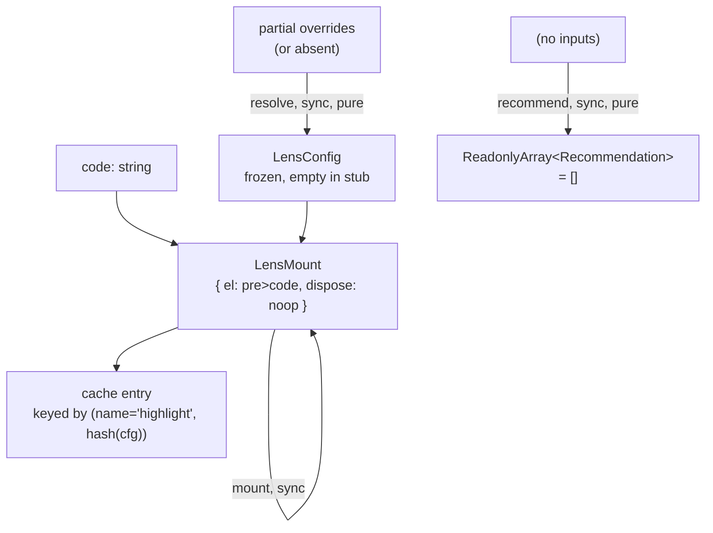

# highlight — Architecture & Decisions

## Why this module exists

The `highlight` lens is the read-only syntax-view counterpart to the
editable [`editor`](../editor/) lens. The eventual real implementation
is a Shiki- or Prism-backed syntax highlighter; today this directory
ships a stub.

The stub serves two purposes:

1. **Test fixture for orchestrator lens switching.** Increment 9 wires
   a lens-picker dropdown above the orchestrator host. The dropdown
   needs ≥ 2 lens options to be testable, and the cache-hit reattach
   sandbox checkpoint needs ≥ 2 lenses to switch between. The
   `editor` stub alone is not enough.
2. **Visually distinct second lens.** The editor stub renders an
   editable `<textarea>`; this stub renders a read-only
   `<pre><code>`. A sandbox observer (and a screenshot regression
   test) can tell at a glance which lens is currently mounted.

## Why a stub

Building a real syntax highlighter at the same time as the
lens-picker toolbar would overload Increment 9. The stub is the
smallest substitute that satisfies the contract:

- It has the correct default-export shape (frozen `LensModule`).
- It returns a real `LensMount` (`el` + `dispose`) — not a Promise.
- It is visually distinct from the editor stub.

What the stub does NOT do: parse, tokenize, syntax-highlight,
dispatch any events, or react to snippet changes. Those arrive with
the real highlighter in Increment 15+.

## Replacement contract

The real highlight lens MUST keep:

- Same file path: [`./highlight.ts`](./highlight.ts).
- Same default export: a frozen `LensModule`.
- Same `name` field: `'highlight'`.
- Same backwards-compatible `lens(code, cfg)` signature; may switch
  the return type from `LensMount` to `Promise<LensMount>` if it
  picks Shiki (lazy theme loading) over Prism (synchronous).

The orchestrator does not need to change when the swap happens. The
stub-vs-real difference is observable only through the `data-lens`
attribute (today `"highlight-stub"`; the real lens picks its own
value, e.g. `"highlight-shiki"`).

## Architectural sketch

### Execution phases

1. **Mount** (sync today, may become async post-replacement) — create
   a `<pre>` wrapping a `<code>` text node, populate the inner
   `<code>` with the snippet text, return a `LensMount` whose
   `dispose()` is a no-op.
2. **Config resolution** — accept partial overrides; spread + freeze;
   cast back to `LensConfig`. The stub has no configuration surface;
   the real lens may grow theme / language / line-numbering options.
3. **Recommend** — return an empty array. The real highlight lens
   will populate this once the analysis pipeline lands per
   [`../../../.planning-handoffs/02-analysis-and-recommender.md`](../../../.planning-handoffs/02-analysis-and-recommender.md).

### Data flow

The "pre&gt;code" node is `<pre data-lens="highlight-stub"><code>...</code></pre>`
today. The replacement (Increment 15+) returns a `<pre>` whose inner
contents are tokenized + colorized; the outer container shape is
unchanged.

### Structural constraints

- **No React import.** This file is pure TypeScript. The replacement
  may use a framework-agnostic highlighter (Shiki / Prism) which does
  not require React.
- **`dispose()` is owned by the lens.** The orchestrator calls it on
  unmount and on cache eviction; the stub's dispose is a no-op
  because there are no listeners or external resources to release.
  The real highlighter may register intersection-observers or
  language-loader subscriptions whose dispose contract becomes
  non-trivial.
- **Read-only.** No edit propagation, no `snippet-changed` dispatch.
  External snippet changes propagate via `onSnippetChanged` (not
  implemented in the stub) — when added, the real highlight lens
  will re-render the entire token tree.
- **Cache survival across switch.** When the orchestrator caches a
  `highlight`-stub mount and reattaches it later, the displayed
  snippet remains unchanged because the DOM node was detached, not
  destroyed. Same survival mechanism as the editor stub — see
  [`../../orchestrator/DOCS.md`](../../orchestrator/DOCS.md)
  §Switch flow for the orchestrator-side guarantee.

### Out of scope

- **Token-level interaction.** Stub renders raw text. Click-to-jump,
  hover-tooltip, AST-aware highlighting all belong to the real lens.
- **Theme / language config.** Stub ignores config overrides entirely.
  The real lens will define a `theme` and `language` field on its
  `LensConfig`.
- **Recommend-time analysis.** Stub returns `[]`. The real lens
  consumes the analysis report from `lib/analysis/` (TBD).

## Why a `<pre><code>` structure (not just `<pre>`)

The `<pre><code>` pattern is the de facto standard for code blocks in
HTML — semantic, accessible, styleable. Both Shiki and Prism produce
DOM in this shape. Using the same shape in the stub means the
replacement is a content swap inside the inner `<code>`, not a
structural change. CSS targeting `pre code { ... }` works against the
stub and against the real lens.

## Module ownership

This module owns:

- [`./highlight.ts`](./highlight.ts) — the `LensModule` default
  export.
- [`./tests/highlight.test.ts`](./tests/highlight.test.ts) — vitest
  jsdom unit tests.

Consumers:

- [`../../orchestrator/default-registry.ts`](../../orchestrator/default-registry.ts)
  imports the default and registers it.
- The orchestrator wrapper at
  [`../../orchestrator/study-lenses.tsx`](../../orchestrator/study-lenses.tsx)
  resolves it through `registry.getLens('highlight')`.

No other consumers. The replacement (Increment 15+) keeps the same
import surface.

## Future direction

When the Shiki/Prism replacement lands:

- This DOCS.md grows a "Highlighter integration" section describing
  language loading, theme wiring, and the dispose contract for
  long-lived subscriptions.
- The data-flow diagram's mount edge may flip to async if Shiki is
  chosen.
- The "no `onSnippetChanged` hook" structural constraint flips —
  the real lens MUST re-render on external snippet changes.
- The `recommend()` empty-array short-circuit becomes a real
  Block-Model placement function consuming the analysis report.
