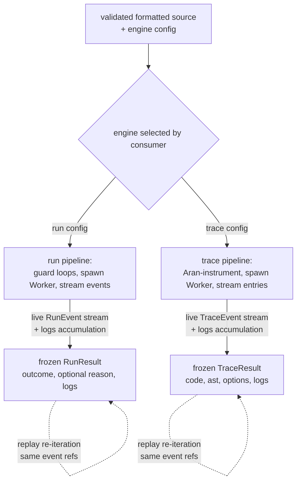

# evaluating — Architecture & Decisions

## Data flow

What happens to the validated, formatted source after the consumer
picks an engine. The two engines produce different result shapes
but share the same execution-isolation pattern (Worker + SAB pause
protocol).

Consumers drive each engine the same way — `for await` for live
event streaming, `await result` for batch consumption, `.cancel()`
or for-await break to stop early. The result types diverge because
the engines surface different domain data: run yields what the
program *did* (console output, dialogs, errors); trace yields what
the program *was* (AST-level execution steps). Parse / validate /
format gates run upstream of this diagram (see `../validating/` and
`../formatting/`).

## Why three separate engines

Each engine serves a different pedagogical use case with a fundamentally different
isolation model and output type:

- **run** uses a Web Worker because it needs timeout safety (`worker.terminate()`)
  and synchronous I/O traps (SAB+Atomics for `prompt`/`confirm`/`alert`). Yields
  `RunEvent` objects — the consumer builds UI from logged events.

- **debug** uses an iframe because `debugger` statements only pause execution when
  DevTools is open on the main thread — workers have no DevTools access. Yields
  0-1 `DebugEvent` (error only) — the debugging happens interactively in DevTools.

- **trace** uses a Web Worker with Aran AST instrumentation to capture every
  expression, variable access, and control-flow step. Yields structured `AranStep`
  objects for visualization. Uses a Vite-bundled module worker (not blob URL)
  because the Aran tracer is ~500KB of ESM code.

## Shared contract

All engines follow the same contract:

1. Each engine's public entry composes `validate` (from `lib/validating/`) and
   `checkFormat` (from `lib/formatting/`) as gates inside its lazy-startup
   pipeline. The engine's body assumes already-validated, formatted code.
2. Execute in isolation (worker or iframe — never on the main thread)
3. Yield events via AsyncGenerator, one at a time
4. Return frozen event arrays on completion
5. Never throw — errors are captured and returned as data

## Why AsyncGenerator for all engines

All three engines return async generators for API consistency. The generators are
wrapped by `createExecution` (from `shared/`) inside each engine's public entry
to produce `Execution` objects with PromiseLike backward compatibility.

The run and trace engines use SAB pause to block the Worker between events —
giving the consumer full control over pacing. The debug engine's generator is
minimal (0-1 events) because the iframe shares the main thread — there is no
Worker to pause.

## Why no unified "execute" function

The output types are fundamentally different (`RunEvent` vs `AranStep` vs
`DebugEvent`). A unified function would require either a discriminated union that
consumers must narrow, or runtime type checks — both worse than separate
well-typed functions.

## How `shared/` is consumed

`shared/` provides infrastructure used across all engines:

- **`types.ts`** — `Execution`, `EngineConfig`, `DebugEvent`,
  `RunEvent`, action configs
- **`create-execution.ts`** — factory wrapping async generators into `Execution`
  objects (PromiseLike, re-iteration, cancel)
- **`guard-loops/`** — loop guard injection for while loops (used by run with
  comma-in-condition, debug with body-injection)

## Why guard-loops is in shared (not debug)

Both run and debug engines need loop guard injection. Previously `guard-loops/`
lived inside `debug/` — run relied on timeout only. With the refactor, run also
injects guards when `config.iterations` is set. The module moved to `shared/` to
reflect this shared dependency.

## Why formatting was extracted

The `format/` directory previously lived inside `debug/` because only debug
reformatted code after loop guard injection. With the format gate (formatting
required before execution), formatting is a standalone concern — it moved to
the top-level `formatting/` module. Debug no longer calls `formatCode()`.
