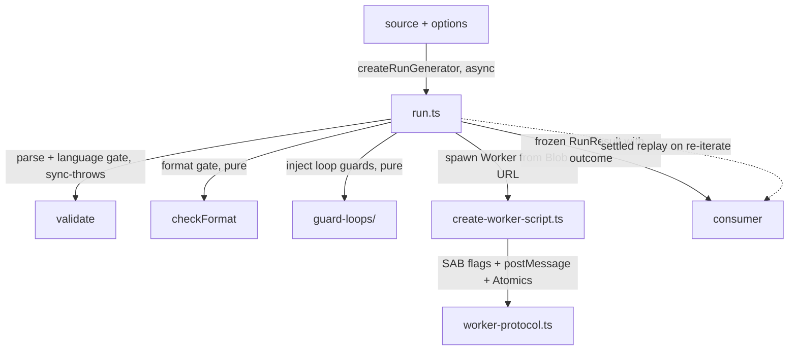

# evaluating/run — Architecture & Decisions

## Data flow

Files-as-nodes view of this leaf directory. `guard-loops/` is shown
as a single subdirectory node because it has its own DOCS.md diagram
at its own abstraction level.



Domain-agnostic utilities (deepFreezeInPlace, structuredClone) are
invisible — called within nodes, not shown between nodes.

## Why an AsyncGenerator

The run engine needs to produce events incrementally for live UI rendering while
supporting batch consumption for backward compatibility. An async generator lets
the consumer pull events one at a time (`for await`) or drain all at once
(`await`). The returned handle itself is `PromiseLike` — no external wrapper is
needed to support `await run(code)`.

The generator pauses the Worker between events using the SAB pause protocol
(see `evaluating/shared/DOCS.md`). This guarantees events are delivered in
correct order relative to I/O — log events appear before prompt dialogs.

## Architectural Sketch

> Structural contract for the merged run engine. Written Phase 0 of
> the `api/run → evaluating/run` merge; the implementation in this
> directory is held against it. Domain terms only; no function
> names, no variable names, no pseudocode.

This sketch captures three invariants that distinguish the merged
engine from the pre-merge split: the unified pause protocol (shared
with trace), native replay on the RunHandle, and the timer-vs-yield
interaction that makes "stepping time does not count" actually hold.
The § sections below ("Why an AsyncGenerator" onward) give the "why"
behind specific design decisions — tradeoffs, alternatives
considered, constraints — and use the same ubiquitous language as
the sketch.

### Unified pause protocol

Consumer-observable invariant: each Worker-emitted event surfaces to
the consumer exactly once, the Worker does not run further learner
code until the consumer pulls again, and the cumulative timer does
not fire while a Worker is paused-with-pending-event (it reschedules).

**Execution phases**, per event, starting when a trap fires in the
Worker and ending when the consumer's next pull resumes execution:

1. **Flag-arm (Worker, sync)** — Worker trap stores the pause flag
   to "paused" and stores the event-ready flag to "set," in that
   order. Both stores are sequentially consistent per slot (no
   multi-slot atomic primitive exists; the "together" is an ordering
   claim, not a hardware-atomic claim).
2. **Post (Worker, sync)** — Worker trap posts the event payload on
   the message channel. **Happens-before**: the flag stores in step 1
   must precede `postMessage`, so any main-thread dequeue of the
   posted event is guaranteed to observe both flags set via the
   message-channel synchronization edge. Posting before the flags
   would open a race window: main thread dequeues, reads flags, sees
   "not paused," misinterprets.
3. **Block (Worker, sync)** — Worker trap blocks on the pause flag
   via `Atomics.wait`. This is the only point where the Worker
   thread yields control back to the runtime.
4. **Dequeue (main, async)** — The main loop receives the posted
   event via the message channel and resolves its pending wait.
5. **Timer-guard (main, sync, only if the cumulative timer happens
   to fire during this window)** — When the timer fires, the
   handler first deducts the elapsed budget (unconditionally — time
   elapsed is time elapsed, regardless of whether the Worker is
   paused), then reads the event-ready flag. If the flag is set AND
   the remaining budget is positive, the Worker is paused with a
   pending event and the handler reschedules for the remaining
   budget — it does NOT mark the run as timed-out. Otherwise, the
   run times out. (This ordering — deduct elapsed first, then check
   EVENT_READY — matches trace's pattern and must match; diverging
   gives different budget behavior.)
6. **Yield (main, async)** — The main loop surfaces the event to
   the consumer. The cumulative timer is paused before this step
   begins (see § Timer-vs-yield). Consumer may take arbitrarily long.
7. **Resume (main, sync)** — On the consumer's next pull: clear the
   event-ready flag first, then release the pause flag, then re-arm
   the cumulative timer with the preserved remaining budget.
   Ordering constraints:
   - Clear-before-release: clearing the flag after releasing the
     pause would race against the Worker's next trap arming the
     flag again; the main thread would clobber a fresh signal.
   - Release-before-rearm: the micro-window between releasing the
     pause flag and re-arming the timer (typically sub-microsecond)
     is uncharged to the budget. This is accepted — ultra-short
     runtime between events doesn't meaningfully shift the timeout
     behavior, and rearm-before-release would fire the timer on a
     still-paused Worker.

**Structural constraints**:

- Per-slot sequential consistency of `Atomics.store` plus the
  happens-before edge of `postMessage` delivery is what makes the
  protocol correct. Implementations that try to be clever with
  batching or relaxed ordering are out of spec.
- The timer handler consults the event-ready flag AFTER deducting
  elapsed time and BEFORE marking timed-out. Missing this guard
  surfaces a race where a paused Worker with a pending event is
  reported as stuck.
- The event-ready flag is cleared before the pause flag is released.
- The pause flag is released before the next event can be produced.
- This protocol is shared with the trace engine. Both engines'
  timer handlers read the same flag. Divergence (each engine using
  its own flag) is an anti-goal.
- The intentional macrotask-break idiom used in the pre-merge
  engine (an `await setTimeout(0)` between yield and resume, to
  guarantee the wall-clock timer callback a firing slot) becomes
  unnecessary once the timer is paused during yield. The resume
  step runs as a straight sync sequence.

**Cancel interaction**:

- Cancel during **Flag-arm/Post/Block** (inside the Worker): cannot
  happen — these are synchronous and uninterruptible on the Worker
  side.
- Cancel during **Dequeue**: the cancel flag is set on the main
  thread and `wakeDequeue` unsticks the pending wait via a sentinel
  push. The main loop observes the cancel flag on its next
  iteration, pushes a CancelEvent to the log, and breaks.
- Cancel during **Yield**: the main loop is awaiting the consumer;
  cancel flag is set. On the consumer's next pull the macrotask
  schedules the next iteration, which observes the cancel flag and
  exits without releasing the pause (Worker is terminated by the
  finally block).
- Cancel during **Resume**: observed before the release, so the
  pause flag is NOT released and the Worker is terminated while
  still paused. Clean teardown.

**Out of scope**:

- The response-slot protocol used by dialog IO (`prompt`, `alert`,
  `confirm`). That is a separate two-way mechanism already in place;
  this sketch does not alter it.
- Per-engine event shape. Both engines carry different event
  payloads; the pause protocol is agnostic.

### Unified termination protocol

Consumer-observable invariant: every path that ends a run (natural
completion, cancel via `.cancel()`, break out of a live `for await`,
wall-clock timeout, guarded-loop iteration-limit, runtime error)
resolves to a settled RunResult whose `outcome` field classifies the
cause. The RunResult is cached for replay. The Worker is torn down
in every case.

**Execution phases**:

1. **Set cause (main, sync, first-write-wins)** — any termination
   entry point calls a single `setTermination(cause)` helper. The
   helper writes only if the cause closure variable is null;
   otherwise the earlier cause wins and the new one is dropped.
2. **Wake dequeue (main, sync)** — a sentinel is pushed to the
   queue if empty; any pending `await dequeue()` resolves.
3. **Dispatch (main, sync, top of the while-loop)** — the body's
   main loop reads the cause on each iteration. Branch on kind:
   - `cancel` → push CancelEvent into logs, break.
   - `timeout` → push TimeoutError into logs, yield it, break.
   - `worker-error` → push error into logs, break.
   - Runtime error in learner code is carried via the message
     channel as an error event; main loop pushes and breaks.
4. **Finally (main, sync)** — `worker.terminate()`, revoke the
   Blob URL, clear any pending timer.
5. **Build result (main, sync)** — `buildResult(logs, ...)`
   classifies `outcome` from the log contents:
   - TimeoutError errorEvent → `timeout`.
   - Iteration-limit RangeError → `iteration-limit`.
   - Any other errorEvent → `error`.
   - Trailing CancelEvent (no error) → `cancel`.
   - Otherwise → `complete`.

**Precedence** (first-write-wins):

| First-set cause | Wins over any later-set | Rationale |
| --- | --- | --- |
| `cancel` (via `.cancel()` or `.return()` for break) | yes | consumer intent takes precedence |
| `timeout` | yes (if arrives first) | wall-clock budget exhausted |
| `worker-error` | yes (if arrives first) | Worker crashed — main thread cannot override |

Under first-write-wins, concurrent triggers produce non-deterministic
but always-consistent outcomes: whichever called `setTermination`
first wins. No priority ladder; the closure variable's monotonic
write is the single source of truth.

**Structural constraints**:

- CancelEvent (the trailing `{event:'cancel'}`) is constructed
  inside `body()`'s cancel-branch, never in an interceptor.
  Identity-stable replay requires the same reference lives in both
  `logs` and the frozen RunResult's `logs` array.
- The `.return` interceptor drives body via `origNext`, never
  `origReturn`. Native `.return()` aborts body before `buildResult`;
  that would regress to the pre-fix broken state.
- The `.return` / `.next` interceptors short-circuit on `isDone`
  per ECMA-262 §27.6.3.3.
- `deepFreezeInPlace` freezes logs recursively; no post-push event
  mutation. The outcome field on the RunResult is frozen with the
  rest.

**Out of scope**:

- Consumer-propagated error via `gen.throw(e)` or a `.fail(reason)`
  method. The runtime's for-await body throw already routes through
  `.return()` here — classified as `outcome: 'cancel'` because the
  engine cannot distinguish "consumer threw" from "consumer broke."
  If a real consumer need surfaces, add a `.fail(reason)` method on
  RunHandle that sets a dedicated cause variant.
- Additive outcome enrichment for trace/debug. `TraceOutcome` and
  `DebugOutcome` are already typed (subsets of `RunOutcome`) but
  their engines don't yet set the field. Migration is additive.

### Replay / re-iteration on RunHandle

Consumer-observable invariant: after a run completes (successfully,
via a thrown error, or via cancel), a second `for await` over the
same handle surfaces the same event references as the first
iteration, in the same order, with no Worker respawn.

**Execution phases**:

1. **Pull (main, async)** — Worker emits an event (via the unified
   pause protocol above); the main loop dequeues it.
2. **Accumulate (main, sync)** — The main loop pushes the event
   reference (not a clone) into the run's internal log array. This
   is the ONLY point at which events enter the log; the push
   happens before the yield. If cancel has been signaled before
   this point, the main loop pushes a CancelEvent as the final
   entry instead of an emitted event.
3. **Yield (main, async)** — The consumer receives the reference.
4. **Completion (main, sync)** — When the main loop exits (normal
   completion, timeout, error, or cancel), the run's final result
   (including the log) is constructed and frozen in place. No
   clone; the references in the log are the exact references the
   consumer saw during yield.
5. **Replay iteration (post-completion)** — The consumer begins a
   new `for await` over the same handle. The handle returns a fresh
   iterator positioned at the start of the frozen log. No Worker is
   created. No new events are produced. The iterator yields each
   log entry in order (same references as live iteration), then
   terminates.

**Structural constraints**:

- The Accumulate step pushes by reference. No clone, no
  normalization, no copy.
- The CancelEvent (if any) is appended by the main thread during
  live iteration — not by the Worker — and lives in the log before
  Completion freeze, so replay sees it as the final entry.
- The final result (including the log) is frozen in place.
  References of event objects survive freeze.
- Replay drains as fast as the consumer pulls. No artificial
  throttle between replayed events; consumers who want a paced
  replay pace it themselves.
- Re-iteration while the run is still in flight returns the same
  underlying AsyncGenerator. Two concurrent consumers will silently
  split events as `.next()` calls serialize — this is documented
  as unsupported; the contract does not promise to throw. Consumers
  must wait for completion (or cancel) before re-iterating.
- Cancel counts as completion. The cancel event is part of the log;
  the replayed iterator yields it as the final entry.

**Out of scope**:

- Partial replay (starting replay from an arbitrary index).
  Consumers iterate from the start.
- Cloning events on replay. Intentionally not offered — reference
  identity is the promise.
- Snapshot export. Consumers who want the raw log read it off the
  result directly.
- Throw-on-concurrent-iteration. Would require separate plumbing
  and doesn't buy enough for the cost; AsyncGenerator's native
  serialize-and-split behavior is accepted as the failure mode.

**For-await-break is supported and equivalent to `.cancel()`**. The
RunHandle's `gen.return()` interceptor routes the runtime's implicit
call (triggered by `break` inside a live `for await`) through the
same cancel path as explicit `.cancel()` — body() reaches its
natural `return buildResult(...)`, a `{event:'cancel'}` is appended
to logs, and the settled RunResult is cached for replay. Consumers
can choose `break` or `.cancel()` interchangeably; identity-stable
replay holds for both.

### Timer-vs-yield

Consumer-observable invariant: the cumulative timer counts only
Worker-thread code-execution time. Time spent yielded to the
consumer (between `for await` pulls) and time spent awaiting IO
callbacks (styled dialogs, slow console mocks) never counts toward
the `seconds` limit.

**Execution phases** per event yield cycle:

1. **Timer pause (main, sync)** — The main loop pauses the cumulative
   timer before surfacing the event to the consumer. The remaining
   budget is preserved (computed as `budget_at_start - elapsed_since_arm`,
   floored at zero).
2. **Yield (main, async)** — Event is surfaced; the consumer may
   take arbitrarily long to pull the next event.
3. **Timer resume (main, sync)** — On the consumer's next pull, as
   the final step of the pause-protocol resume sequence: after
   clearing the event-ready flag and releasing the pause flag, the
   cumulative timer is re-armed with the preserved remaining budget.

Parallel phases for IO-callback path (already in place, preserved):

1. **Timer pause** — Before awaiting the dialog callback.
2. **Callback await** — Main thread awaits the consumer-provided or
   native dialog. May take arbitrarily long.
3. **Timer resume** — After writing the IO response and before
   notifying the Worker.

**Structural constraints**:

- The timer is paused for the entire window between event yield and
  consumer pull. Not partial, not approximate.
- Budget depletion (remaining-ms reaches zero while the Worker is
  running and no event is pending) triggers the timeout path.
- The timer is NOT paused while the Worker is running between traps.
  Only during yield and IO callback await.
- Timeout produces a TimeoutError event in the log and a
  timeout-kind result. No partial budget is refunded.
- The sub-microsecond window between pause-flag release and timer
  re-arm during the resume sequence is uncharged. This is accepted
  (see § Unified pause protocol § Ordering constraints).

**Cancel interaction**:

- Cancel during **Timer pause / Yield / Timer resume** of the event
  path: handled by § Unified pause protocol § Cancel interaction.
  The timer's remaining budget is preserved through teardown (not
  that it matters — the finally block terminates the Worker).
- Cancel during **Callback await** of the IO path: the cancel flag
  is set synchronously, but the IO callback await cannot be
  interrupted. The main loop waits for the callback Promise to
  settle, then observes the cancel flag on the next iteration and
  exits. Native `window.prompt` blocks the main thread
  synchronously, so cancel physically cannot be clicked while it's
  open; for styled/async dialogs the consumer can resolve the
  pending IO promise to shorten teardown.

**Out of scope**:

- Wall-clock timeouts. The engine uses cumulative execution time
  only; wall-clock enforcement is a caller concern.
- Per-event timing telemetry. Consumers who want per-event timing
  measure it themselves.
- Different budgets per phase (e.g. separate budgets for code
  execution vs IO await). The budget is unified.
- Interrupting an in-flight IO callback on cancel. The callback
  runs to natural settle; the Worker is torn down afterwards.

## Why body-injection via string offsets

When `options.iterations` is set to a finite value, the run engine injects loop
guards via `guard-loops/guard-loops.ts`. The technique is **body-injection**: a
guard statement is spliced immediately after the loop body's opening `{`, and a
counter-reset statement is spliced immediately after the closing `}` (or after
the trailing `while (cond);` for do-while).

```js
// before:
while (x < 10) {
    x++;
}

// after (maxIterations = 100):
while (x < 10) { if (++loop1 > 100) throw new RangeError("Loop 1 exceeded 100 iterations.");
    x++;
} loop1 = 0;
```

### Why string-offset splice (not AST reprint)

Splicing at computed character offsets preserves the original source byte-for-
byte everywhere except the two insertion points per loop. An AST reprint
(`recast.print`) normalizes whitespace and comment placement even when a node is
not modified — learner formatting, trailing commas, and whitespace-dependent
tests would fail. String-offset splice gives identical output to input for all
characters not directly adjacent to the insertion points.

### Why body injection (not comma-in-condition)

Comma-in-condition (`while (++loop1 > max && guard(1), cond)`) was the original
design intent documented in early architecture notes but was never implemented.
Body injection achieves the same zero-line-shift property: guard text is
appended to the existing opening `{` line, and reset text is appended to the
existing closing `}` line — no newline characters added, line count preserved
exactly.

### Counter declaration

Counter identifiers (`loop1`, …, `loopN`) are not declared in the learner's
source. The Worker script in `create-worker-script.ts` emits `var loop1 = 0,
..., loopN = 0;` on the same line as `"use strict"` — no additional line added.

### Coverage

Four loop types are covered: `WhileStatement`, `ForStatement`,
`DoWhileStatement`, `ForOfStatement`. `ForInStatement` is deliberately excluded
— not in the JeJ curriculum surface. See `guard-loops/README.md`.

## Resolved IO table

When a run begins, the engine merges consumer-provided mocks with Native IO
wrappers into a single `resolvedIo` object:

```ts
resolvedIo = {
  prompt:  options.io?.prompt  ?? nativePrompt,
  alert:   options.io?.alert   ?? nativeAlert,
  confirm: options.io?.confirm ?? nativeConfirm,
  console: {
    log:   options.io?.console?.log   ?? nativeConsoleLog,
    // ... all 19 methods
  },
}
```

Slot-by-slot — not all-or-nothing. Consumer overrides one key; the rest stay
native. The worker is unaware of which slots are mocked vs. native — it always
sees the same event-emission path. This is what gives us the shape-identical
guarantee (sequence, event tags, and `args` structure preserved).

### IO execution model (unified)

ALL IO hooks hold learner execution until the callback completes. There is no
fire-and-forget category:

- **Dialog hooks** (`prompt`, `alert`, `confirm`): worker blocks on SAB
  `Atomics.wait`. Main thread awaits the callback, writes the response to the
  SAB response slot, then calls `Atomics.notify`. Worker reads response and
  continues.
- **Console hooks** (all 19 methods): worker blocks on the SAB pause flag
  (same mechanism used between every event). Main thread awaits the console
  callback, yields the `ConsoleEvent`, and on the consumer's next `next()` call,
  releases the pause. No response-slot write is needed (console hooks return
  `void`; nothing is delivered back to the worker).

The net effect: learner code does not proceed past any IO call until the
callback completes, whether native or mocked.

### Mock error handling

Native IO hooks do not throw. If a consumer-provided mock throws (sync or async
rejection), the main-thread catch path surfaces an `ErrorEvent` with
`name: 'InternalError'`. The worker is terminated. The learner sees an internal
error, not an exception from their own code. This is the only circumstance where
an IO callback's exception reaches the learner's event stream.

## Why cumulative timeout (not wall-clock)

Timeout tracks execution time only. The timer pauses:

- While the worker is blocked on the SAB pause flag (waiting for the consumer's
  `next()` call)
- While the main thread is awaiting any IO callback (dialog or console)

When execution resumes, `setTimeout(remainingMs)` restarts.

This means a learner stepping through events in the UI can take as long as they
want — only actual code execution counts toward the limit. Without this, a
learner examining step 3 of 100 could trigger a timeout while doing nothing. The
same applies to styled dialogs: a consumer-provided `prompt` mock showing a
custom modal does not count against the learner's execution time budget.

## Why a Web Worker

The worker provides two things: **timeout control** and **sandboxing**. An
iframe cannot be forcibly stopped mid-execution — `worker.terminate()` can.
Learner code with infinite loops or long-running operations must be killable
after `maxSeconds`. The worker also isolates learner code from the main thread's
DOM and globals.

## Why two-step protocol

The worker receives two messages: **setup** (SAB + trap definitions) and
**execute** (learner code). This separation exists for line number accuracy.

If trap definition code were prepended to the learner's source string, every
line number in error messages and stack traces would be offset by the preamble
length. By defining traps in a separate setup phase, the learner's code starts
at line 1 when wrapped in `new Function`.

The `"use strict"` prefix inside `new Function` adds exactly 1 line of offset,
which is a known constant that the line extraction logic subtracts.

**Invariant**: the setup message handler must be fully synchronous. Worker
message delivery is ordered, so `execute` is dequeued only after `setup`
completes — but only if `setup` does not yield (no `await`, no dynamic
`import()`). If a future change adds async work to setup, the protocol
must add a `setup-ready` acknowledgment message.

## SharedArrayBuffer protocol

Workers cannot call `prompt()`/`confirm()`/`alert()` natively. To provide
synchronous I/O from the learner's perspective, the worker blocks on a
SharedArrayBuffer while the main thread shows native browser dialogs.

### Why SAB+Atomics (alternatives explored)

The only two practical approaches to synchronous worker↔main communication are:

1. **SAB+Atomics** — worker blocks via `Atomics.wait`, main thread responds via
   `Atomics.notify`. Requires COOP/COEP headers.
2. **Sync XHR + ServiceWorker** — worker makes a synchronous `XMLHttpRequest`
   to a ServiceWorker-intercepted URL, which holds the request until the main
   thread provides the response. No header requirement, but adds ServiceWorker
   registration complexity and its own deployment constraints.

Everything else (postMessage, BroadcastChannel, Comlink) is asynchronous and
cannot block the worker. WASM shared memory is SAB under the hood (same header
requirement). There is no zero-cost synchronous path.

SAB+Atomics was chosen because it is simpler, more reliable, and the COOP/COEP
requirement is the hosting platform's concern — not this package's.

### I/O flow — dialog hooks (prompt/alert/confirm)

1. Worker encounters `prompt("name")` via trapped global
2. Worker posts `io-request` message to main thread
3. Worker sets control signal to `1` (waiting) and calls `Atomics.wait`
4. Main thread receives message, awaits `resolvedIo.prompt("name", undefined)`
   (native browser dialog or consumer mock — both awaited the same way)
5. Main thread writes response to buffer, sets signal to `2`, calls
   `Atomics.notify`; on callback throw, surfaces `ErrorEvent { name:
   'InternalError' }` and terminates worker
6. Worker unblocks, reads response, resets signal to `0`
7. Trapped `prompt` returns the value to the learner's code

### I/O flow — console hooks

1. Worker calls (e.g.) `console.log("hello")` via trapped global
2. Worker posts `event` message (ConsoleEvent) to main thread
3. Worker blocks on the SAB pause flag (`Atomics.wait` on pause slot)
4. Main thread receives event, **pauses the cumulative timer**, then awaits
   `resolvedIo.console.log("hello")` (native console or consumer mock)
5. Timer restarts; on callback throw, surfaces `ErrorEvent { name:
   'InternalError' }` and terminates worker
6. Main thread yields the `ConsoleEvent` to the generator consumer
7. Consumer calls `next()` → main thread releases pause (`Atomics.notify`)
8. Worker unblocks and continues execution

Console hooks use the existing SAB pause mechanism (the same pause used between
every event). No response-slot write is needed — nothing is delivered back to
the worker. The cumulative timer is explicitly paused (step 4) and restarted
(step 5) so that slow consumer mocks (typewriter animations, network calls, etc.)
do not count against the learner's execution time budget.

### COOP/COEP requirement

SharedArrayBuffer requires these HTTP headers on the hosting page:

```http
Cross-Origin-Opener-Policy: same-origin
Cross-Origin-Embedder-Policy: require-corp
```

This is the hosting site's responsibility. If SAB is unavailable, `run` returns
an `EnvironmentError` event rather than throwing.

## Why errors are events

Throwing exceptions forces consumers into try-catch patterns and loses partial
results (e.g., logs before the error). Returning errors as events in the array
means:

- Consumer always gets `RunEvent[]` back
- Partial results (logs before a crash) are preserved
- Construction errors and runtime errors use the same interface
- `phase: 'creation'` vs `'execution'` distinguishes when the error occurred

## Why all traps are always defined

Traps are not config-driven. Every run defines all 19 standard console methods,
alert, confirm, and prompt — regardless of what the future allow/block config
says. The allow/block config controls **static validation** (which AST nodes are
permitted), not which traps exist at runtime.

This keeps the worker script static and simple. Config-driven trap selection
would add conditional logic to the worker script string for no clear benefit —
if a learner's code calls `prompt()` but prompt is not in the allow config, the
static validator catches it before `run` is ever called.

## Why no runtime enforcement

Earlier designs included an `enforceLevel` step that blocked unauthorized
globals and prototype methods via property descriptors on the worker's
`globalThis`. This was removed because static validation via
`validating/` catches all disallowed constructs at the AST level
before execution. Runtime enforcement was belt-and-suspenders complexity with no
practical benefit at this language level.

## Line tracking

Each trap function uses `new Error().stack` to extract the source line relative
to the user code offset. The `new Function` wrapper with `"use strict"` prefix
means user code starts at line 2 — the extraction logic subtracts 1.

This is browser-dependent. Chrome, Firefox, and Safari format `Error.stack`
differently. The line number in `RunEvent` is best-effort — correct in common
cases, possibly wrong for edge cases like multi-line expressions.

### scriptMode

The `execute` message accepts an optional `scriptMode` flag (see
`types.ts`'s `ExecuteMessage`). When true, the worker omits the
`"use strict";\n` prefix in front of user code. This is needed for
constructs that strict mode forbids — most notably the `with`
statement, which some legacy/teaching examples use.

Because scriptMode removes the prefix line, user code starts at line
**1** instead of line 2. `getLine()` branches on `isScriptMode`:
return the raw stack line number directly when `scriptMode` is true,
or subtract 1 when it's false. Same branch exists in
`extractLineFromError` for uncaught runtime errors.

scriptMode is a worker-side setup concern only — the main thread
never needs to know. Consumers who pass `scriptMode: true` get line
numbers that match their source 1:1.

## Why new Function instead of eval

`new Function('console', 'alert', 'confirm', 'prompt', code)` provides argument
shadowing — the trapped functions are passed as arguments, cleanly overriding
globals without property descriptor manipulation. This is simpler and more
reliable than patching `globalThis` for these specific APIs.

## Structured clone safety

Trap arguments pass through `postMessage`, which uses the structured clone
algorithm. Most JeJ values (strings, numbers, booleans, null, undefined, arrays)
clone without issue. If a learner somehow passes a function or symbol to
`console.log`, structured clone would throw. The traps catch this and fall back
to string serialization for uncloneable arguments.

## Worker script duplication

The worker runs from a Blob URL and cannot import modules. The SAB read-side
protocol (wait for signal, read response, reset) must be inlined in the
generated worker script string. This means some logic exists in both
`worker-protocol.ts` (typed, importable, used by main thread) and the worker
script string (plain JS, used by worker). This duplication is intentional —
the alternative (bundling or dynamic imports in workers) adds complexity that
is not justified for this amount of code.

## Why console routing goes through Resolved IO

Console calls are routed through `resolvedIo.console[method]` for the same
reason dialog calls are routed through `resolvedIo.prompt/alert/confirm` — the
Native IO wrapper for each console method is just `window.console[method]`. The
consumer can replace it with a styled panel renderer, a typewriter animation, or
any other async function. Routing through the Resolved IO table is what provides
the shape-identical guarantee: whether native or mocked, the `ConsoleEvent` in
the stream looks identical. Event emission serves the UI/analysis layer; the
native wrapper serves authenticity when no mock is provided.

## What this module deliberately does NOT do

- **Resolve allow/block config** — that is `evaluating/shared`'s job
- **Enforce language level at runtime** — static validation (run inside the
  engine's lazy-startup pipeline, ahead of Worker spawn) is sufficient
- **Manage the worker script as a separate file** — Blob URL from string avoids
  bundler/path concerns

Note: validation (`validating/`) and format checking (`formatting/`) are
invoked *from* this module during lazy startup — they run before Worker
spawn, inside the generator body. They are not separate consumer-visible
steps. See `README.md` § Lazy startup pipeline.
