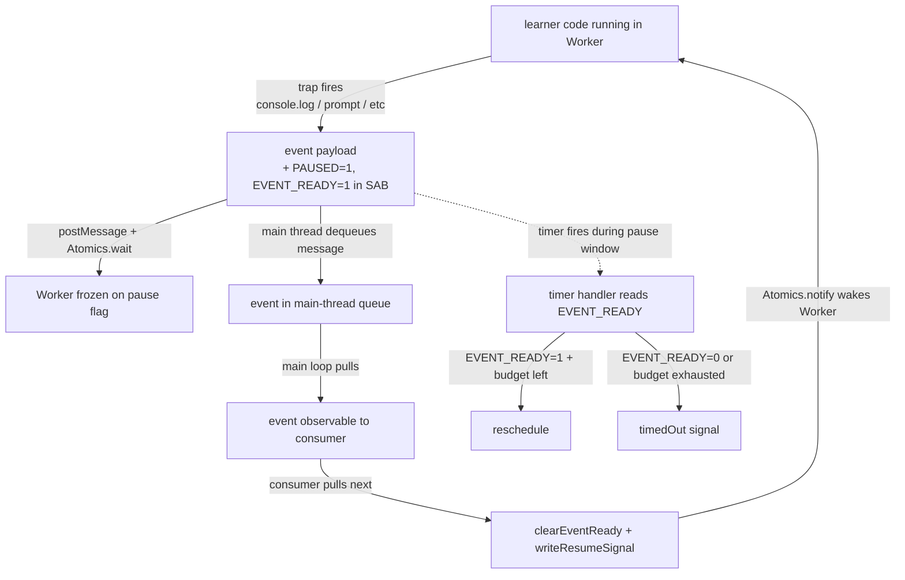

# evaluating/shared — Architecture & Decisions

## Data flow

This module hosts cross-engine primitives — the `Execution` contract
type and the SAB pause protocol — that mediate the data flow between
the Worker thread (where learner code runs) and the main thread
(where the consumer pulls events). The diagram below shows the
shape of the data as it crosses the worker↔main boundary on a
single event cycle.



The data of interest at each phase: a learner program runs in the
Worker; trap calls become event payloads that cross to the main
thread via `postMessage`; the main thread surfaces them to the
consumer; the consumer's pull triggers a resume that lets the
Worker produce the next event. The SAB flags are the data states
that the timer handler reads to decide reschedule-vs-timeout. Run
and trace use this same flow — engine-specific behavior (event
shapes, replay) lives in their per-engine DOCS.md.

## Why one AsyncGenerator per engine

Each engine needs to produce events incrementally (for live UI rendering) while
also supporting batch consumption (for backward compatibility). An AsyncGenerator
satisfies both: `for await` pulls events one at a time, while `await execution`
drains everything and resolves to the final result.

Alternatives considered:

- **Callback/EventEmitter**: no backpressure, consumer cannot control pacing.
  The generator's pull-based model lets the consumer decide when to advance.
- **ReadableStream**: heavier API surface, less ergonomic for `for await`, and
  the PromiseLike backward-compat trick wouldn't work naturally.
- **Observable**: not built into the language, would add a dependency.

## Why Execution is PromiseLike

`Execution` implements `.then()` by delegating to `.result`. This means
`await run(code, { seconds: 5 })` resolves to the same `RunResult` as today's
`await run(code, 5)`. Existing consumers work unchanged — no silent breakage.

The `.result` Promise is created eagerly. If nobody iterates the generator,
an internal drain loop consumes all events and resolves `.result`. This prevents
the generator from hanging indefinitely.

## Why re-iteration replays from cache

After the generator completes, events are stored in `.result.logs`. A second
`for await` iterates over the cached array rather than re-executing. This
supports use cases like: render events live, then analyze them afterward —
without running the learner's code twice.

## SAB pause protocol

The Worker must pause between events so the main-thread generator can yield them
one at a time. Without pause, events would queue up in the message channel and
arrive in bulk — defeating the purpose of streaming.

### Buffer layout

The control array uses 6 `Int32` slots. `PAYLOAD_BYTE_OFFSET` is 24.

```text
control = Int32Array(sab, 0, 6)    →  bytes 0-23
  [0]: I/O control (0=idle, 1=waiting, 2=responded)
  [1]: response type (0=string, 1=boolean, 2=void)
  [2]: null flag
  [3]: payload byte length
  [4]: pause flag (0=running, 1=paused)
  [5]: event-ready flag (0=not ready, 1=ready)
payload = Uint8Array(sab, 24)      →  bytes 24+
```

### Why Atomics.wait for pause (not message-based)

Message-based pause (posting "pause"/"resume" messages) would require the Worker
to poll its message queue — `onmessage` fires asynchronously and cannot block
synchronous code mid-execution. `Atomics.wait` truly freezes the Worker thread
at the exact instruction, guaranteeing no events leak past the pause point.

### Pause/resume flow — unified protocol (shared by both engines)

Both the run and trace engines follow the same per-event ordering,
coordinated through two slots in the SAB control view: PAUSE
(control[4], 0=running, 1=paused) and EVENT_READY (control[5],
0=not-ready, 1=ready). The Worker-side logic lives in each engine's
traps/advice; the main-thread logic is shared helpers in
`run/worker-protocol.ts`.

1. Worker stores `PAUSED=1` (control[4]) then `EVENT_READY=1`
   (control[5]); the per-slot sequential consistency of
   `Atomics.store` establishes the flags-before-post ordering.
2. Worker calls `postMessage(event)` — the message-channel
   happens-before edge guarantees the main thread observes both
   flag stores when it dequeues the event.
3. Worker calls `Atomics.wait(control, 4, 1)` — blocks while
   PAUSE=1.
4. Main thread dequeues the posted event.
5. Main thread's timer handler, if it fires during this window,
   deducts elapsed then reads EVENT_READY. If set AND budget
   remains, the Worker is paused-with-pending-event — reschedule,
   do NOT mark timed out. If exhausted, mark timed out.
6. Main thread pauses the cumulative timer, yields the event to
   the consumer, waits for the next pull.
7. On resume: main thread clears EVENT_READY (control[5]=0), writes
   PAUSE=0 (control[4]=0), calls `Atomics.notify(control, 4)` to
   wake the Worker, then restarts the cumulative timer. The
   release-before-rearm order accepts a sub-microsecond uncharged
   window so the timer never fires on a still-paused Worker.
8. Worker continues execution until the next trap fires.

The clear-before-release ordering in step 7 matters: clearing after
the release would race against the Worker's next trap re-arming
EVENT_READY, causing the main thread to clobber a fresh signal.
For batch mode (`.then()` / `.result`), an internal drain loop calls
`.next()` rapidly — the Worker still pauses between every event,
but the main-side yield is effectively a pass-through microtask.

### Why EVENT_READY flag (control[5])

Lets the timer handler distinguish "Worker paused with pending
event" (reschedule for the remaining budget) from "Worker stuck in
an infinite loop" (fire timeout). The Worker writes EVENT_READY to
the SAB instantaneously before blocking — faster and more reliable
than inferring "paused with event" from `postMessage` delivery
timing, which is subject to message-channel latency and microtask
ordering.

### Why timedOut flag instead of queued timeout message

With instrumented `while(true){}`, a queued `{ type: 'timeout' }` message sits
behind thousands of entry messages in the FIFO queue. The `timedOut` flag is
checked directly on every loop iteration, bypassing the queue.

## Why cumulative timeout, not wall-clock

Timeout tracks execution time only, not pause time. When the Worker pauses
(waiting for the consumer to call `next()`), the timeout is cleared. When it
resumes, `setTimeout(remainingMs)` restarts. This means a learner stepping
through events can take as long as they want — only actual code execution counts
toward the limit.

## Why create-execution is a factory function, not a class

Per AGENTS.md convention: no classes in this codebase. The factory returns a
plain object with closure-captured state. The generator function and cancel
callback are injected — `createExecution` knows nothing about Workers, SABs, or
engines. Each engine builds its own async generator and passes it to the factory.

## What this module deliberately does NOT do

- Does not validate user code — that's `validating/`'s job
- Does not execute code — that's the individual engine's job
- Only provides shared infrastructure (types, Execution factory, SAB protocol)
- Does NOT own loop-guard injection — that lives in `run/guard-loops/`
  (the run engine is the sole consumer; it was never genuinely shared)
