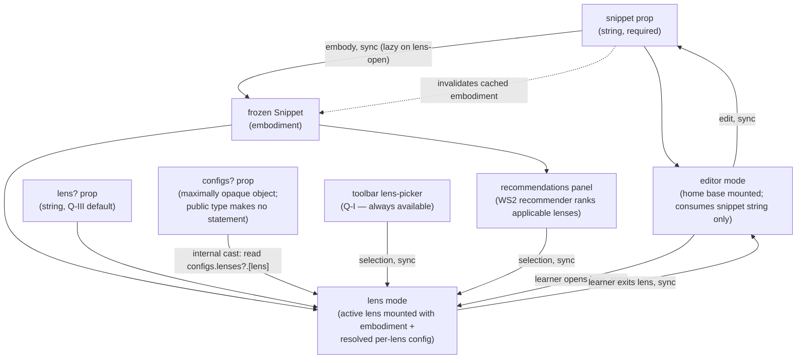
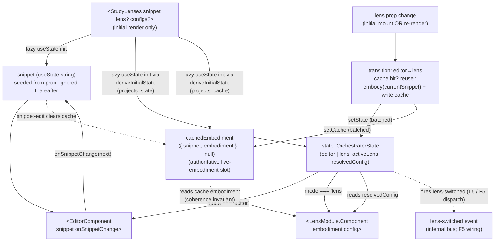
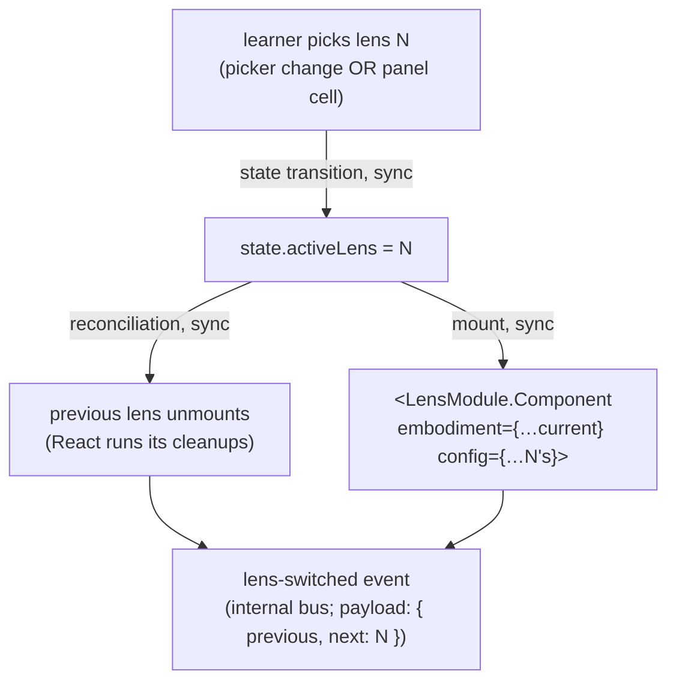
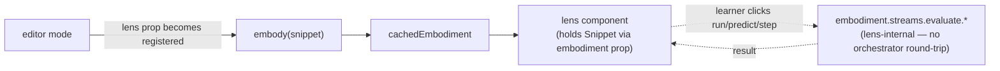

# orchestrate — Architecture & Decisions

## Why this peer exists

`orchestrate/` is the React-aware peer of the three-peer architecture and the
**React seam** between the package's pure-TS substrate (`embody/`,
`orchestrate/lib/*`) and the rendered learner experience. It exports
`<StudyLenses>` — the package's public API.

**At the peer's top level** (the orchestrator itself):

- The `<StudyLenses>` component (`./index.tsx`).
- The toolbar lens-picker, the Q-I always-on surface (`./toolbar.tsx`).
- The recommendations panel UI shell, covering Q-II auto-paths plus Q-III
  ranking-overrides (`./recommendations-panel.tsx`); the recommender engine
  itself lives in `./lib/recommender/`, owned by WS2. Q-IV (manual study paths)
  is deferred entirely.
- The orchestrator-internal types (`./types.ts`): prop contract, 2-mode state
  machine, lazy-embodiment trigger policy, internal EventBus event taxonomy.

**As subdirs** (separable concerns):

- [`./editor/`](./editor/) — the home-base editor, the only writer of snippet
  state.
- [`./lib/`](./lib/) — the pure-TS analysis libs every consumer uses
  (recommender, socratizing, completing, editing, error-interpreting,
  jej-documentation, analysis).

[`embody/`](../embody/) and [`lenses/`](../lenses/) are pure-TS peers;
`orchestrate/` is where React enters and where the learner-facing experience is
assembled. Concentrating everything React-aware here keeps the substrate
testable in vitest without `jsdom` and limits framework-portability concerns to
one peer.

The peer follows a **primary-export-at-top-level** convention: `<StudyLenses>`
and its co-bundled UI files (toolbar, panel, types) sit at the peer's top level,
mirroring [`../embody/`](../embody/)'s convention where `embody()` lives at
`embody/index.ts`. Subdirs (`editor/`, `lib/`) are separable concerns the peer
also owns; the orchestrator's primary export sits above them at the peer root.

> **Prior art**: the pre-refactor orchestrator's architectural sketch was
> relocated to a sibling `orchestrator/` directory during the Phase A refactor
> (commit `5d6fc54`) and then deleted when F1 brought the new orchestrator
> online. Structural patterns documented there carried forward (cleanup-split
> rationale, `vi.hoisted` test pattern, async-caveat for mid-mount
> cancellation); specific mechanisms (cache, framework-agnostic LensMount,
> multi-prop API, always-active lens mount, transforms tier) were superseded per
> the locked decisions in
> [`../README.md` § Pedagogical first principles](../README.md#pedagogical-first-principles).
> The pre-refactor source remains in git history under commits prior to F1.A.

## Architectural sketch

> Written Phase 0, before implementation. The Refactor step of each increment in
> [`../.planning-handoffs/03-orchestrator-and-contracts.md`](../.planning-handoffs/03-orchestrator-and-contracts.md)
> is held against this sketch. Domain terms only — no function names, no
> variable names, no pseudocode (React API names like `useEffect` / `useState` /
> `useRef` are acceptable as structural-mechanism references).
>
> **F2 vs. future increments.** The diagrams below depict the post-F2
> steady state (mode discriminator + single cross-mode embodiment cache +
> editor↔lens transitions wired). The recommendations-panel branch and the
> internal `lens-switched` bus dispatch are L5 / F5 respectively — drawn for
> the system-wide picture, but not consumed at F2 ship. In-mode lens-switching
> (lens → lens) lands in F4 with the registry's first pedagogical trial lens
> (the registry is `{ "debug-props": … }` today). See
> [`../.planning-handoffs/03-orchestrator-and-contracts.md`](../.planning-handoffs/03-orchestrator-and-contracts.md)
> for the per-increment forward schedule.

### Lifecycle modes

The orchestrator's UI is in exactly one of two modes at a time (per
`03-orchestrator-and-contracts.md` F2). This diagram is **peer-level** — the
edge labels name the steady-state learner-facing trigger surface (picker, panel,
in-mode lens-switch). At F2 ship the picker UI doesn't exist yet (L1) and the
registry has only one lens (F4), so the actual mechanical trigger is `lens`-prop
change from the consumer. See § Mode-gated state machine below for the
component-internal view.

```mermaid
stateDiagram-v2
    [*] --> EditorMode: initial mount
    EditorMode --> LensMode: learner opens a lens<br/>(picker L1 / panel L5 / lens prop change)
    LensMode --> EditorMode: learner exits lens<br/>(picker L1 / lens prop unset)
    LensMode --> LensMode: learner switches to a different lens (F4+)<br/>(reuses cached embodiment;<br/>previous lens unmounts)
    EditorMode --> EditorMode: learner edits snippet<br/>(clears cached embodiment)
    LensMode --> [*]: component unmount
    EditorMode --> [*]: component unmount
```



- **Editor mode** — [`./editor/`](./editor/) is mounted; learner is editing the
  snippet string. **No active lens, no embodiment.** Picker is visible.
- **Lens mode** — a lens is active with a frozen embodiment + lens config bundle
  as React props. Snippet is read-only while in lens mode. Switching lenses
  reuses the current embodiment; previous lens unmounts; new lens mounts fresh.

The mode switch from editor → lens is the moment the snippet is snapshotted.
Returning editor → lens later (after edits) builds a NEW embodiment.

### Prop-to-mode routing (peer-level view)

Where each prop ends up. Answers: "what powers the editor path, the lens path,
and the recommendations panel?" Includes the recommender as a sibling of
editor + lens; omits internal state and bus dispatch (those are in the next
diagram).



The recommendations panel opens via an explicit toolbar button or keyboard
shortcut — that open-trigger is a UI affordance, not a data path, so it isn't
drawn in the data-flow diagram. Lands in L5 alongside the panel UI itself.

#### Per-lens config resolution chain

For any lens the learner mounts, the final config feeding
`<LensModule.Component config={…}>` is computed as:

```text
resolved(lensName) = module.config()                  // tier 0: lens defaults
                   ⊕ configs.lenses?.[lensName]       // tier 1: cascade (post-merge with per-fence/sibling override)
```

`⊕` is **deep-merge-right-wins**. The orchestrator computes this two-tier chain
in its pipeline; lens authors don't compute it themselves. There is no separate
per-fence-override tier on the orchestrator side — the plugin pre-merges the
URL-style query / directive JSON INTO `configs.lenses[lens]` before emission, so
the cascade IS the merged truth.

The `configs.lenses?.[lensName]` read is an **orchestrator-internal structural
assumption**, NOT a constraint on the public `configs` type. The public type is
maximally opaque (`Readonly<Record<string, unknown>>`); `resolvePerLensConfig`
casts at the boundary to look up `lenses[lensName]`. If the supplied `configs`
value doesn't expose a `lenses` map (or its `lenses[lensName]` isn't an object),
tier 1 contributes nothing and the chain falls back to `module.config()` alone.

`resolvedDefault` resolution order:

1. The `lens` prop (populated upstream by the plugin from per-fence `:suffix`,
   frontmatter `defaultLens`, or sibling `@study-lens` directive — cascade
   `defaults[lang]` is gate-only and does NOT populate `lens` per AR-1 locked
   decision 1; the cascade-supplied default seam is L2-deferred. Or set directly
   by an MDX-author writing `<StudyLenses lens="…" />`).
2. None — when no default resolves, the orchestrator initializes the mode
   discriminator to `'editor'` and mounts the editor home base. There is no
   mount-time guard; with no separate `config` prop, the pre-3-prop guard has
   no trigger surface.

L2 will extend the resolution order with a cascade-supplied default seam
(currently deferred — the seam shape lives somewhere in `configs` itself; L2's
Phase 0 settles the exact key, e.g. `configs.defaults` re-used or a dedicated
`configs.defaultLens` slot).

**Resolution-chain formula stability.** `resolvedDefault === lens` always
(no cascade-supplied default seam yet). The two-tier chain is the
steady-state shape; L2 may add a third tier ONLY if the cascade-supplied
default seam introduces a config layer (it likely does not — that seam
concerns the default lens NAME, not its config). Implementing agents write
the formula as two tiers.

Steady-state lifecycle:

- `<StudyLenses>` ingests the `snippet` prop.
- `embody()` turns the snippet directly into a frozen `Snippet` — lazy (built
  when a lens or evaluation needs it). Format compliance is checked inside
  `embody` and surfaced via `Snippet.validation.formatted` (boolean) plus
  JEJ-subset violations on `Snippet.validation.violations`. The orchestrator
  does NOT pre-format; formatting is the learner's responsibility.
- The orchestrator switches between **editor mode** (home base active, no lens)
  and **lens mode** (active lens mounted with embodiment + config props).
- The toolbar lens-picker (Q-I) is always visible; the recommendations panel
  (Q-II auto-paths; Q-III ranking-overrides extend it via WS3 increments L7/L8)
  opens via toolbar button. Q-IV (per-snippet manual study paths) is DEFERRED
  entirely.
- An edit in the editor produces a new snippet string; any cached embodiment is
  discarded; the next lens-open or evaluation triggers a fresh embody.

### Mode-gated state machine (component-internal view)

What state lives where, and how the mode discriminator gates the React subtree
mounted at any moment. Answers: "what's in React state, what populates the
embodiment cache, and what does the internal bus dispatch when?" Adds the
mode discriminator + cache slot + bus dispatch the peer-level prop-to-mode
diagram omitted; drops the recommendations panel (which doesn't sit in mode
state).

#### State-diagram form

```mermaid
stateDiagram-v2
    [*] --> InitDerive: mount
    InitDerive --> EditorMode: lens prop unset OR unregistered
    InitDerive --> LensMode: lens prop registered<br/>(sync embody at init populates cache)
    EditorMode --> EditorMode: type into textarea<br/>(setSnippet; clear cache)
    EditorMode --> LensMode: lens prop becomes registered<br/>(reuse cache if cache.snippet === snippet,<br/>else embody + write cache)
    LensMode --> EditorMode: lens prop unset/unregistered<br/>(dispose lens; cache retained)
    LensMode --> [*]: component unmount
    EditorMode --> [*]: component unmount
```



#### Data-flow form



> The state-diagram form omits a self-loop on `LensMode` for snippet edits
> because the editor textarea is unmounted in lens mode — no edit event can
> fire. This is structural enforcement, not a runtime guard.

#### Atomic transition mechanism

The coherence invariant ("when `state.mode === 'lens'`, the cache is non-null
and `cache.snippet === currentSnippet`") is preserved across editor → lens
transitions by **co-batching** both state updates in a single React event
handler. The transition handler — invoked from the `lens`-prop-change effect
(an `useEffect` whose body inspects the registry, calls `embody()` if the
cache is stale, then dispatches both setters in succession) — relies on
React 18 auto-batching to fold the two updates into one commit:

1. `deriveInitialState({ snippet, lens, configs })` is the single-pass helper
   that computes `{ state: OrchestratorState; cache: CachedEmbodiment | null }`
   from the initial props. Both `useState` lazy initializers project their
   respective field from the same call so the lens-mode case calls `embody()`
   exactly once at first render.
2. Mid-flight transitions (e.g. `lens` prop changes after mount) follow the
   same shape: a single handler computes the next `{ state, cache }` pair,
   then calls `setState(next.state)` and `setCachedEmbodiment(next.cache)` in
   that order from the same React event/effect body. Both setters land in the
   same commit; the lens-mode subtree never renders against a null cache.
3. If `embody()` throws, neither setter is dispatched and the throw
   propagates out of the effect body. The cache is not written, the mode
   discriminator does not flip, and the React error boundary at the
   consumer site surfaces the error. The "atomic" property still holds —
   either both slots advance together or neither does.

This is the one mechanical decision a re-implementing agent must honor:
**both setters must dispatch from the same React event handler / effect
body, never split across a microtask boundary.** Splitting them would expose
a one-frame window where the lens-mode subtree mounts against a stale or
null cache.

#### Failure modes (embody trigger + lens internals)

Errors the orchestrator coordinates between the embody trigger and the mounted
lens:

- **Validation / parse error at embody trigger** — surfaces in lens mode at the
  moment the trigger fires (lens-open from editor). `embody` does NOT throw; it
  returns a `Snippet` whose `status.parsed=false` (or equivalent gates),
  `errors` field, and `validation.{formatted, isJeJ, violations}` flags carry
  the diagnostic. The lens receives that embodiment and displays per its own
  error-surface contract. NOT surfaced while typing.
- **Transient: `embody()` throws on unrecognized input.** Today's embody
  (per [`../embody/index.ts`](../embody/index.ts) JSDoc) recognizes 11 named
  scenario keywords and dispatches a canned `Snippet` shape for each; any
  other input throws synchronously while the real-composition path is
  incomplete. The throw propagates out of the transition handler, neither
  the mode flip nor the cache write commits (per § Atomic transition
  mechanism), and the React error boundary at the consumer site surfaces
  the throw. The steady-state `embody(code): Snippet` contract above
  forbids throws for any input; real composition lands slice-by-slice per
  [`../EMBODY-IMPL-HANDOFF.md`](../EMBODY-IMPL-HANDOFF.md) and brings embody
  into contract compliance for non-scenario input. Scenario dispatch
  itself is permanent (not scaffolding). F3 (orchestrator-side lazy
  embodiment) is independent of this; it governs only **when** embody
  fires, not how embody reports errors.
- **Evaluation error inside a lens** — surfaces only when the lens's evaluation
  triggers (run / predict button), even if detectable statically. Per lens's own
  error-surface contract.
- **Async setup inside a lens** — async resource loading (e.g. CodeMirror
  language modules) lives inside the lens's React component, not in the embody
  trigger. The orchestrator's embody trigger is **sync** by contract: embody →
  cache. If a future evaluation engine needs async embody, that contract change
  re-opens this section; until then, sync.

### Switch flow (lens-mode internal)

When already in lens mode and the learner picks a different lens via the picker
or panel:



Snippet does NOT change during a lens-mode switch — same embodiment is fed to
the new lens. The previous lens's in-progress UI state (parsons shuffle, blanks
fills) is gone (per disposability). The new lens's `LensModule.Component` mounts
fresh; if it does async setup, it manages that internally.

The `lens-switched` event fires INTERNALLY (no outbound emit). The picker
re-renders to reflect the new default-selected option.

### Effect topology

The orchestrator owns **four named effect categories**. Editor and
lens-internal effects are listed second for system-wide context, but they are
not orchestrator categories — they're the neighbors' effects shown so the
cross-module picture is visible in one place.

**Orchestrator-internal effect categories** (load-bearing names; specific deps
and ordering set by F2):

| Category                            | Triggers on                                                | What it does                                                                                                              | Cleanup                                |
| ----------------------------------- | ---------------------------------------------------------- | ------------------------------------------------------------------------------------------------------------------------- | -------------------------------------- |
| **Embody trigger**                  | editor → lens transition with stale or null cache          | `embody(currentSnippet)` once → write `cachedEmbodiment` slot atomically with the mode flip                               | None — embodiment is plain frozen data |
| **Lens-mount dispatch**             | `state.mode === 'lens'` (initial mount OR after transition) | Render `<LensModule.Component embodiment={cachedEmbodiment.embodiment} config={resolvedConfig} />` in place of the editor | Per-lens React `useEffect` cleanups    |
| **Lens-switch dispatch**            | active-lens change while in lens mode (F4+ in-mode switch)  | Fire `lens-switched` (payload `{ previous, next }`) on the internal bus (wiring lands in F5)                              | None                                   |
| **Embodiment-on-edit invalidation** | `onSnippetChange` fires while in editor mode               | `setSnippet(next)` + `setCachedEmbodiment(null)` (the next editor → lens transition rebuilds)                             | None                                   |

**Neighbor effects (system-wide context, not orchestrator categories)**:

| Module                      | Effect                  | Triggers on                    | What it does                                                                              | Cleanup                       |
| --------------------------- | ----------------------- | ------------------------------ | ----------------------------------------------------------------------------------------- | ----------------------------- |
| `orchestrate/editor/`       | Editor mount / teardown | editor mode entered / exited   | Construct CodeMirror EditorView async; append to host; tear down (`destroy()`) on cleanup | `EditorView.destroy()`        |
| `lenses/<name>/` (per lens) | Lens-internal effects   | lens-component mount / unmount | Lens-author concern (e.g. parsons shuffle, blanks state, async language modules)          | Per-lens `useEffect` cleanups |

What's NOT in the topology (vs the pre-refactor design):

- ~~`mountActiveLens`~~ — React reconciles components by tree position; no
  manual mount/detach.
- ~~`disposeOnUnmount` cleanup orchestrating `mount.dispose()` for every cached
  lens~~ — no cache; each lens's own `useEffect` cleanups run when React
  unmounts it.
- ~~`onSnippetChanged` IoC dispatch to cached mounts~~ — no cache; no in-place
  propagation. React unmounts the lens; the next embodiment props feed a fresh
  mount.

See [`./editor/DOCS.md`](./editor/DOCS.md) for the editor module's
mount/teardown details.

### Internal event taxonomy (sketch)

The internal EventBus carries intra-component coordination events. F2 locks
the type-level shapes for `lens-switched` and `mode-changed`; F5 wires the
actual dispatch:

| Event                | Fires on                                  | Implemented in | Notes                                                                                                                                                                       |
| -------------------- | ----------------------------------------- | -------------- | --------------------------------------------------------------------------------------------------------------------------------------------------------------------------- |
| `lens-switched`      | active-lens transition (lens-mode switch) | F5             | Payload: `{ previous: string \| null, next: string, source?: LensSelectionSource }`. Picker re-render trigger. `source` is optional pending F5's dispatch-site enumeration. |
| `mode-changed`       | editor ↔ lens mode transition             | F5             | Payload: `{ from: 'editor' \| 'lens', to: 'editor' \| 'lens' }`. Subscribers reading the next active lens correlate with `lens-switched` (ordering below).                  |
| `exercise-completed` | lens fires its own completion signal      | future         | Lens-internal; orchestrator forwards. Shape per-lens, opaque to orchestrator.                                                                                               |
| `lens-mount-error`   | lens throws during mount or async setup   | future         | Surfaces lens errors to the orchestrator's error UI.                                                                                                                        |

**Dispatch ordering** (load-bearing contract for the minimal `ModeChangedPayload`
shape): on an editor → lens transition, `mode-changed` is dispatched
**before** `lens-switched` within the same React commit. Subscribers that
need the new active lens name AT mode-change time should subscribe to
`lens-switched` and read the `to` field from the most recently observed
`mode-changed`. The ordering is deterministic because both dispatches issue
from the same transition handler in sequence; the EventBus is sync and
listeners run in registration order.

The taxonomy is **internal-only**: no `subscribe` / `onEvent` prop on
`<StudyLenses>` until a concrete LMS integration target appears (per F5). When
that target appears, the externalized protocol can be a curated subset of these.

### Structural constraints

- **Public surface is one component**: `<StudyLenses>`. **Three props** total —
  one required (`snippet`), two optional (`lens?`, `configs?`). Everything else
  internal. See § Per-lens config resolution chain (above) for how
  `configs.lenses[lens]` flows per lens. The pre-3-prop `config?` prop is
  absorbed into `configs.lenses[lens]` at plugin emission time.
- **No consumer-side branching on `snippet.source.code`.** `embody(code)`
  recognizes 11 named scenario keywords (`"OK"`, `"FAIL_AT_PARSE"`,
  `"EVAL_TIMEOUT"`, …) and dispatches a canned `Snippet` shape for each;
  these scenarios are a permanent integration-testing fixture set (not
  scaffolding). Orchestrator code MUST NOT use `snippet.source.code` as a
  branching discriminator (`source.code === "OK"`, substring tests,
  regex). Always branch on the resulting `Snippet`'s
  `status.{tokenized, parsed, validated, created}`, `errors`,
  `validation.{isJeJ, isDeterministic, doesPause}`, and `endReport.outcome`
  (from a resolved `streams.evaluate.run()`). Rendering `source.code`
  verbatim (e.g. a source-display lens) is fine; using it as a key is not.
  See [`../embody/README.md` § Named scenarios](../embody/README.md) and
  [`../embody/index.ts`](../embody/index.ts) JSDoc.
- **Single-writer state.** Only [`./editor/`](./editor/) mutates snippet source.
  The orchestrator threads the editor's `onSnippetChange` callback into its
  state-update; lenses receive `embodiment` via props and have no mutation
  surface.
- **Editor mode vs lens mode** is a 2-state machine. There is no concurrent
  "editor + lens" rendering. Editor mode = home base mounted, no lens, no
  embodiment. Lens mode = active lens mounted with frozen embodiment + config;
  snippet is read-only.
- **Lazy embodiment.** The orchestrator builds a new `embodiment` only when
  something downstream needs it (lens-open from editor, evaluation trigger
  inside a mounted lens). Never on every keystroke; no debounced background
  re-embody; no speculative pre-build.
- **Disposable practice.** Snippet edits invalidate any cached embodiment AND
  trigger React unmount of the active lens. When re-entering lens mode against
  the new snippet, a fresh lens mount happens with the new embodiment.
  Lens-internal UI state is per-mount only.
- **Internal-only EventBus** (per WS3 handoff F5). The orchestrator's bus
  coordinates intra-component communication (picker → orchestrator → mounted
  lens). No outbound `subscribe` prop on `<StudyLenses>` until a concrete LMS
  integration target exists.
- **Picker always visible**: the toolbar lens-picker dropdown is shown in BOTH
  editor mode and lens mode — it's the Q-I autonomy guarantee.
- **Recommendations panel is opt-in UI**: opens via toolbar button or keyboard
  shortcut. Not always visible; not modal.
- **Async caveat carries forward**: any `useEffect` body that awaits a Promise
  (async lens setup, future async embody) creates a microtask gap between
  effect-fire and side-effect-completion. Subscribers to `lens-switched` that
  need the new mount in the DOM should defer their work to a microtask or
  `requestAnimationFrame` (the pre-refactor orchestrator's effect topology
  surfaced this as Phase 2 step 4; durable rule).
- **Dependency rules** (per `../DOCS.md` § Dependency rules):
  - `orchestrate/` may import from `orchestrate/lib/*`, `embody/`, `lenses/`,
    `@-utils`.
  - `orchestrate/lib/*` may import from sibling `orchestrate/lib/*`, `embody/`,
    `@-utils`. Never from `lenses/`.
  - `lenses/<lens>/*` receives `embodiment` via props from the orchestrator. May
    import (type-only) from `embody/types.ts` and (runtime + type) from
    `orchestrate/lib/*` and `@-utils`. Never imports runtime values from
    `embody/` (top) or `orchestrate/` (top).

### Out of scope

- **Embodiment construction details** — owned by [`../embody/`](../embody/). The
  orchestrator just calls `embody(snippet)` and consumes the returned `Snippet`.
- **Format pre-processing** — `embody` checks format compliance via
  `Snippet.validation.formatted` and surfaces JEJ-subset violations via
  `Snippet.validation.violations`; the learner formats their own code; the
  orchestrator does not pre-format. (Was sketched in earlier drafts; removed per
  the user-confirmed Phase 0 decision.)
- **Lens internals** — owned by [`../lenses/`](../lenses/). The orchestrator
  passes `embodiment` + `config` props; what the lens does inside is its own
  concern.
- **Recommender engine** — owned by [`./lib/recommender/`](./lib/recommender/)
  (WS2). The orchestrator's panel UI consumes the engine's output; it does not
  re-rank.
- **Editor implementation** — owned by [`./editor/`](./editor/). The
  orchestrator threads its callback prop and renders it in editor mode.
- **System-wide learner state, knowledge graph, ZPD positioning** — LMS's job
  per `../DOCS.md` § "What we explicitly do NOT own".
- **Multi-snippet path arrangement** — LMS's job. Each `<StudyLenses>` instance
  is one stepping stone; the LMS arranges them.
- **Grade reports / LMS integration / cheating detection** — top of the pyramid;
  LMS responsibility.
- **An outbound data-emit protocol** — DEFERRED until a concrete LMS integration
  target exists. Internal events stay internal.
- **Per-snippet manual study tours (Q-IV)** — DEFERRED entirely per
  `03-orchestrator-and-contracts.md` § Layer IV. Auto- recommended Q-II tours
  via the panel are sufficient.

## Pyramid mapping

`orchestrate/` ships **the orchestrator side of Layers I-III** of the
Explorotron pyramid (per `../README.md` § Pedagogical first principles):

| Layer                              | What `orchestrate/` provides                                                                                                                           | Where it lives                                                                         |
| ---------------------------------- | ------------------------------------------------------------------------------------------------------------------------------------------------------ | -------------------------------------------------------------------------------------- |
| Layer I (Lenses & defaults)        | Toolbar lens-picker dropdown over the registered lens roster                                                                                           | `orchestrate/toolbar.tsx` (planned)                                                    |
| Layer II (Path generation)         | Recommendations panel UI consuming the WS2 recommender's filtered + ranked grid                                                                        | `orchestrate/recommendations-panel.tsx` (UI) + `orchestrate/lib/recommender/` (engine) |
| Layer III (Manual recommendations) | `lens` + `configs` prop seam pre-filled by per-fence info-string and `lenses.json` cascade (per-fence override pre-merged into `configs.lenses[lens]`) | `orchestrate/index.tsx` (consumes the props)                                           |
| Layer IV (Manual study paths)      | DEFERRED at snippet scope (per `03-orchestrator-and-contracts.md` § Layer IV)                                                                          | n/a                                                                                    |

The pyramid base (Progress modelling) and top (Monitored learning) are
explicitly NOT owned by `orchestrate/` — those belong to the embedding LMS.

## Why two-mode state machine (vs always-active)

The pre-refactor design always had a lens mounted (the editor lens was the
default). When the learner edited code, the editor lens absorbed the edits via
its own UI; other lenses (parsons, blanks) reacted via `onSnippetChanged`.

The new architecture's editor-vs-lens split makes the editing- vs-exercising
boundary explicit:

- In editor mode, the learner is **authoring** code — the editor is the focus;
  no lens is active; no embodiment is built.
- In lens mode, the learner is **exercising** an embodiment — the snippet is
  frozen; the lens is the focus.

Benefits:

- **Simpler state.** No "editor lens edits while parsons lens shuffles"
  concurrency. One mode at a time, one clear focus.
- **Lazy embodiment is natural.** Building embodiments only at mode transition
  matches what the learner expects: typing is cheap; opening an exercise costs
  an embody.
- **Disposability is structural.** Snippet edits in editor mode don't disturb
  any lens — there is no lens. The next lens-open builds a fresh embodiment.

The cost is a UX nuance: the learner can't type code WHILE watching parsons
shuffle reorder. Per the locked disposable-practice decision and the Explorotron
framing, this is the intended pedagogical model: practice surfaces (lenses) are
distinct from authoring surfaces (editor); switching modes is an explicit
pedagogical commitment.

## Why lazy embodiment

The pre-refactor design built embodiments eagerly: every effect re-run rebuilt
or revalidated. That was fine because the "embodiment" was light (a parsed AST).
The new `embody()` factory is heavier — it bundles parse, validation, scope
analysis, metrics, and (eventually) entwined event streams.

Building embodiments on every keystroke would be wasteful when most keystrokes
are mid-statement and not yet parseable. The lazy strategy ties embody
construction to **explicit user actions** (open a lens, run/predict an
evaluation phase) — moments where the learner has paused and the snippet is
meaningful to inspect.

This also aligns the **error-surfacing UX**: validation / parse /
format-compliance signals appear at lens-open time (not while typing) — surfaced
via `Snippet.validation.*` and `Snippet.errors` on the returned embodiment.
Evaluation errors appear at run/predict time (not statically). Per the
lifelong-learning autonomy principle, this avoids intruding on the learner's
typing with real-time syntax-error spam.

### F3 — lazy embodiment realized

F3's locked deliverable was "build embodiment only when downstream needs it"
— specifically on (a) lens-open from editor and (b) evaluation phases inside
a mounted lens, with no re-embody on keystrokes / no debounced re-embody / no
speculative pre-build. **F3 is satisfied as of F2.5; no separate F3 increment
ships.**

**How each F3 deliverable is satisfied today:**

- **Lens-open trigger** → F2.4's `deriveInitialState` transition path. Embody
  fires once on editor → lens transition; cache-hit short-circuits round trips.
- **Evaluation phases inside a mounted lens** → **lens-internal, not
  orchestrator-mediated.** The `Snippet` returned by `embody()` exposes
  `streams.evaluate.{run, intercept, trace.{syntax, semantics}}` (see
  [`../embody/types.ts § Streams`](../embody/types.ts)). The lens has the
  embodiment as a prop and calls these methods directly when the learner
  clicks run / predict / step. No orchestrator round-trip. The cached
  embodiment from mount is always fresh inside a lens-mode session because
  snippet state is frozen there (the editor is unmounted; F2.1's
  initial-value-only contract prevents external snippet mutation).
- **No re-embody on keystrokes** → F2.4 removed the unconditional
  `useEmbodiment` useMemo.
- **Eager edit invalidation** → F2.5's `handleSnippetChange` wrapper clears
  `cachedEmbodiment` on every edit, so a post-edit lens-open always
  re-embodies (even after a type-then-undo back to the cached snippet).



*Dotted edges in this diagram depict lens-internal evaluation flow that
bypasses the orchestrator entirely — distinct from the dotted-edge idiom
used elsewhere in this file for side-effect / invalidation arrows.*

**Snippet-content-blindness invariant.** The orchestrator's transition
handler + cache layer never inspects `Snippet.source.code` content as a
branching discriminator. (Sibling `orchestrate/lib/*` modules may operate
on derived strings — error messages, identifier autocomplete, AST-derived
voices — but never on raw snippet content for dispatch.) The handler MAY
compare snippet strings as **cache keys** via **full-string identity only**
(`prevCache.snippet === snippet`, answering "is this the same snippet I
already embodied?") — that's cache-validity, not semantic dispatch.
Substring, prefix, regex, or pattern tests against snippet content are
forbidden **even when used to gate cache behavior** (e.g.
`if (snippet.startsWith("//"))` as a cache-bypass optimization is also a
violation). Branches that need to know what the code does consume only
the resulting `Snippet`'s `status` / `errors` fields — today, the
orchestrator does no such branching; it forwards the embodiment to lenses
without inspection.

This invariant aligns with [`../embody/README.md` § Named scenarios](../embody/README.md)
anti-pattern note ("no consumer-side branching on `snippet.source.code`")
and persists as embody's body grows real-composition slices on the
non-scenario path (per
[`../EMBODY-IMPL-HANDOFF.md`](../EMBODY-IMPL-HANDOFF.md) Step B1+).
Scenario dispatch is a permanent producer-side affordance, not transitional
scaffolding; the orchestrator stays blind to which path produced a given
Snippet.

**What F3 did NOT add:**

- No new domain terms (glossary unchanged).
- No new contract types (`LensProps`, `OrchestratorState`, `CachedEmbodiment`,
  all event payloads — unchanged from F2's locked shapes).
- No new effect category — F2's four-category § Effect topology (Embody
  trigger + Lens-mount dispatch + Lens-switch dispatch + Embodiment-on-edit
  invalidation) already encodes F3's trigger discipline.
- No new tests — F2's 384-test suite already covers the load-bearing F3
  behaviors (embody fires only on transitions; cache-hit on round-trip;
  edit-eager invalidation; no embody on typing). Evaluation phases are
  lens-internal and have no orchestrator surface to test.
- No sandbox change — the F2 sandbox at `src/pages/f2-mode-machine.tsx`
  already exercises the F3 UX path under scenario dispatch (type a
  scenario keyword → toggle to lens → parse-error scenario surfaces in
  debug-props' panels). The "type arbitrary code" sandbox flow unblocks
  fully once real composition for non-scenario input lands per
  [`../EMBODY-IMPL-HANDOFF.md`](../EMBODY-IMPL-HANDOFF.md) Step B1+.

## Why internal-only EventBus

The pre-refactor design implicitly assumed an LMS would consume events from the
orchestrator (lens-mounted, exercise-completed, etc.). The new architecture
defers that protocol entirely until a concrete integration target exists.

Reasons for deferral:

- **Premature interface design risks lock-in.** Without a real LMS in hand, we'd
  guess at event payload shapes, subscribe-prop signatures, and timing
  semantics. Wrong guesses become hard to reverse once curriculum authors depend
  on the contract.
- **Internal coordination is enough today.** The picker + the recommendations
  panel + the editor all live inside the same React tree; React's natural
  component composition + a private EventBus suffice for intra-`<StudyLenses>`
  plumbing.
- **The event taxonomy can mature internally.** As lenses ship and the
  orchestrator's coordination needs grow, the internal events evolve. When an
  LMS appears, the externalized protocol can be a curated subset of the internal
  events that proved useful.

The internal EventBus inherits from the pre-refactor Inc-9 EventBus pattern
(`bus.dispatch`, `bus.subscribe`, `bus.clear`) but is not exposed on
`<StudyLenses>`'s prop surface.

## Why the editor is a peer subdir, not a lens

In the pre-refactor architecture the editor was a `LensModule` named `'editor'`
— also the unknown-name fallback target. That made it look like
just-another-lens, but it was structurally different: only the editor lens was
meant to mutate snippet state; every other lens was read-only. The
framework-agnostic `LensMount` contract didn't enforce this distinction.

The new architecture makes the distinction structural:

- `orchestrate/editor/` is a peer subdirectory, not a lens. It's the
  always-present home base.
- The editor's React component takes an `onSnippetChange` callback prop — the
  only mutation surface for snippet state in the whole system.
- Lenses receive `embodiment` (frozen) via props; they have no mutation surface.

The single-writer model is enforced at the type level: only the
`orchestrate/editor/` component's prop signature accepts an `onSnippetChange`
callback. A lens's `LensProps` (in `../lenses/types.ts`) has no such field.

## Why four named effect categories (vs Inc-9's three named effects)

The pre-refactor Inc-9 design had three named effects: `disposeOnUnmount`,
`mountActiveLens`, `dispatchSwitch`. The new topology has four categories
covering the same problems plus the cache-lifecycle work the Inc-9 design
implicitly assumed away:

- **Inc-9 `disposeOnUnmount`** managed cache disposal on real unmount. Replaced
  by **per-lens-React-cleanup** — each lens's `useEffect` cleanups run when
  React unmounts it. No central registry to clean up.
- **Inc-9 `mountActiveLens`** managed the framework-agnostic mount lifecycle
  (attach/detach `mount.el` to host ref). Replaced by **React reconciliation** —
  the orchestrator just renders `<LensModule.Component>` and React handles the
  rest.
- **Inc-9 `dispatchSwitch`** fired `lens-switched` events. Survives as the
  **lens-switch dispatch** category in the new topology.

Two new categories appear because the cross-mode embodiment cache is a
first-class orchestrator concern:

- **Embody trigger** — replaces what used to happen inside the pre-refactor
  `mountActiveLens` body (validate, execute pipeline, lens.lens). Embody
  centralizes the substrate calls; only fires at the cache-stale moment of
  an editor → lens transition.
- **Embodiment-on-edit invalidation** — new because the pre-refactor design
  always had an active embodiment. Lazy embodiment requires explicit
  invalidation when the snippet changes; the editor's `onSnippetChange` is
  the single trigger.

The two cache-lifecycle categories are kept distinct rather than merged into
"Embody trigger" because they have different React shapes: the embody-trigger
runs from the `lens`-prop-change effect body, the invalidation runs from the
editor's `onSnippetChange` callback. They never co-fire.

## Module ownership

What this peer owns is enumerated in
[`./README.md` § What lives here](./README.md); this section calls out only the
**negative-space** boundaries — what looks like it might belong here but
doesn't, plus the one load-bearing open-spec item.

**Open-spec item the peer owns**: the **lens registry** mechanism. B
bootstrapped a single-entry static map keyed by lens name
(`{ "debug-props": DebugPropsLens }`) at the peer's top level for the
sandbox-harness verification path; F4 Phase 0 settles whether the registry stays
a static map, grows a runtime `register()` API, or refactors entirely when the
first pedagogical trial lens lands. Either way the registry lives at the peer's
top level alongside the `<StudyLenses>` component.

This peer does NOT own:

- The `embody()` factory or its substrate (lives in [`../embody/`](../embody/)).
- Specific lens implementations (live in [`../lenses/`](../lenses/)).
- Per-lib content for the analysis libs — owned by WS2 (recommender, analysis)
  and per-lib sessions (socratizing, completing, editing, error-interpreting,
  jej-documentation).
- The Docusaurus plugin's prop emission contract (lives in
  `src/plugins/study-lenses/`; alignment is flagged in
  `03-orchestrator-and-contracts.md` Cross-handoff impact).

## Future direction

- The async-embody affordance (loading state during embody-on-trigger) is **not
  in scope** at the orchestrator level — F3 shipped with sync embody and the
  contract above forbids async embody. If a future evaluation engine genuinely
  needs async embodiment construction, that's a contract change reopening
  § Lifecycle modes — not a tweak to today's sync transition handler.
- The picker + panel coexistence visual design (overlapping? side-by-side? modal
  panel?) lands during L5's Phase 0 sandbox checkpoint.
- Outbound LMS event protocol — designed when a concrete integration target
  appears. The internal EventBus is the wire-tap point; the public contract
  stays minimal until then.
- Per-snippet manual study tours (Q-IV) — re-introducible if a curriculum need
  surfaces. Per `03-orchestrator-and-contracts.md` § Layer IV, the path is a
  `sequence` field inside `config` (no new top-level prop) plus a
  sequential-walk-through component inside `orchestrate/`.
- `orchestrate/lib/` index — as more analysis libs land, the index README may
  grow into a richer per-lib summary table.
