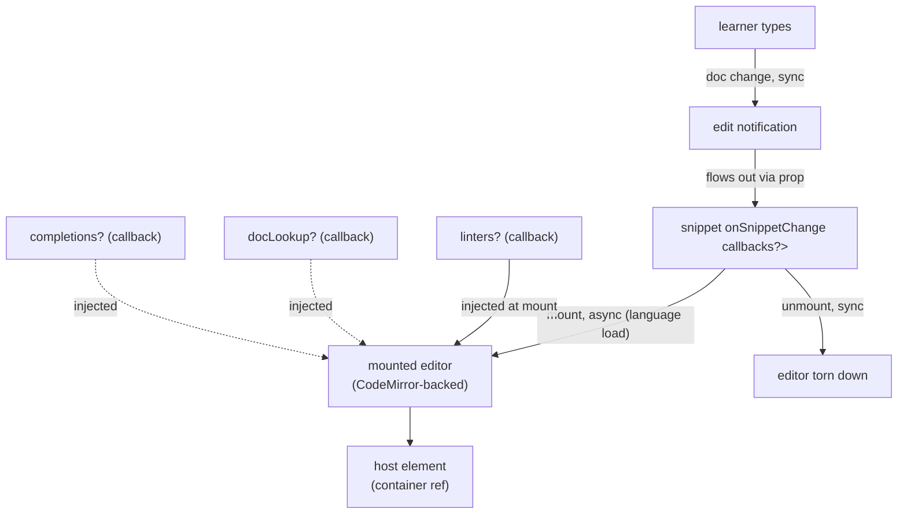

# editor — Architecture & Decisions

## Why this module exists

`orchestrate/editor/` is the **always-present home base** — the React
component the orchestrator mounts in editor mode. It's the **only
writer of snippet state** in the entire `<StudyLenses>` system.
Everything else (lenses, recommender, analysis libs) is a read-only
consumer of the snippet via the embodiment the orchestrator builds.

Concentrating snippet mutation in one component makes the
single-writer state model structural rather than conventional: a
lens trying to mutate the snippet has nowhere to send the mutation.
The orchestrator only threads `onSnippetChange` to the editor;
lenses receive `embodiment` (frozen) and have no comparable
callback.

> **Prior art**:
> [`../../lib/editing/DOCS.md`](../../lib/editing/DOCS.md)
> documents the underlying CodeMirror integration — language
> loading, callback API for linters / completions / hover docs,
> destroy lifecycle. That module moves to `orchestrate/lib/editing/`
> during REFACTOR-HANDOFF Step 9 unchanged in shape; this
> `orchestrate/editor/` component is a new thin React wrapper around
> its `createEditor()` factory.

## Architectural sketch

> Written Phase 0, before implementation. The Refactor step of F1's
> editor-mount work is held against this sketch. Domain terms only —
> no function names, no variable names, no pseudocode (React API
> names like `useEffect` / `useState` / `useRef` are acceptable as
> structural-mechanism references, mirroring the orchestrator
> DOCS's escape clause).

### Data flow

The component is intentionally thin: most logic lives inside
[`../lib/editing/`](../lib/editing/) (post-refactor) /
[`../../lib/editing/`](../../lib/editing/) (pre-refactor)'s
editor-construction factory. The component's job is just:

1. **Construct** the underlying editor via the `lib/editing/`
   factory in a `useEffect` mount (async; CodeMirror language
   modules load dynamically).
2. **Append** the constructed editor's element to a host
   container ref.
3. **Forward edits** via the `onSnippetChange` prop on every
   document change.
4. **Tear down** in the `useEffect` cleanup (factory's
   destroy/dispose path).

### Per-mode behavior

The orchestrator mounts `<EditorComponent>` only in editor mode
(per [`../orchestrator/DOCS.md` § Lifecycle modes](../orchestrator/DOCS.md)).
On the editor → lens mode transition, the orchestrator unmounts the
editor and the embodiment is constructed at that moment — not while
the editor is mounted.

The mode-transition asymmetry to be explicit about:

- **Snippet content survives** mode transitions: it lives in the
  orchestrator's state (controlled-component model), so when the
  editor remounts after returning lens → editor, the snippet string
  is whatever the orchestrator currently has.
- **Cursor / undo / selection do NOT survive** mode transitions:
  they live in CodeMirror's view instance, which is destroyed at
  unmount. Remount creates a fresh view; cursor lands at default
  position, undo history is empty.

### Structural constraints

- **Single writer**. This component (and its `onSnippetChange`
  callback) is the ONLY surface that produces snippet mutations
  in the whole `<StudyLenses>` system. No lens has a comparable
  callback prop. Per the locked decision in
  [`../../README.md` § Pedagogical first principles](../../README.md#pedagogical-first-principles)
  + [`../DOCS.md` § Locked decisions](../DOCS.md).
- **Consumes raw `snippet: string`, not `embodiment: Snippet`.**
  The orchestrator builds the embodiment downstream of the editor
  (at the editor → lens mode transition). The editor never sees
  an embodiment. This is what makes the editor structurally
  distinct from a lens: different input shape (string vs frozen
  Snippet), different lifecycle role (write surface vs read-only
  view).
- **Async setup boundary**. `createEditor()` is async (dynamic
  language loading). Use `useEffect` + a state machine OR
  `React.lazy` + `<Suspense>` to handle the async mount; never
  block render. Specific approach pins during F1's Phase 0.
- **No internal snippet state**. The component is **controlled** —
  `snippet` flows in from props, edits flow out via
  `onSnippetChange`. The orchestrator owns the snippet string in
  its own state. Avoids drift between an internal-snippet-state
  and the orchestrator-snippet-state.
- **Pedagogical callbacks are pass-through**. `linters`,
  `docLookup`, `completions` (per `lib/editing/`'s callback API)
  are forwarded from the orchestrator's analysis libs. This
  component doesn't know what the callbacks do; it just wires
  them into the editor.
- **Disposability**. CodeMirror-owned view state (cursor position,
  undo history, selection) is destroyed at unmount; a fresh view is
  constructed at remount. Cursor / undo / selection are NOT
  preserved across mode transitions. This matches the system-wide
  disposability principle. (Snippet content is orchestrator-owned
  and DOES survive — see § Per-mode behavior.)

### Out of scope

- **CodeMirror integration internals** — owned by
  [`../lib/editing/`](../lib/editing/) (post-refactor) /
  [`../../lib/editing/`](../../lib/editing/) (pre-refactor).
- **Snippet persistence across page reloads** — LMS's job.
- **Auto-save / draft management** — out of scope; the LMS or
  the embedding application owns this if needed.
- **Multi-file editing / tabbed buffers** — out of scope. One
  `<StudyLenses>` instance = one snippet.
- **Read-only mode** (e.g. for showing reference solutions) —
  not a use case today; if it surfaces, it's a prop on this
  component (`readOnly?: boolean`) plus a one-line CodeMirror
  extension.

## Why a thin React wrapper around `lib/editing/createEditor()`

The pre-refactor `lib/editing/createEditor()` is a fully-baked
async factory: it returns a CodeMirror `EditorView` ready to
append to the DOM, with linters / hover / completions injected
via callback. It's framework-agnostic (no React, no
`@docusaurus/BrowserOnly`).

`orchestrate/editor/` could:

- Replace `createEditor()` with a React-native CodeMirror
  integration (e.g. `@uiw/react-codemirror`).
- Wrap `createEditor()` in a thin React component.

We chose option 2 because:

- **`createEditor()` is already AR-reviewed** and battle-tested.
  Replacing it would re-derive design decisions (callback API,
  destroy semantics, dynamic language loading) for marginal gain.
- **Framework-agnostic core, React boundary at the wrapper** is
  the same pattern as [`../../lenses/`](../../lenses/) (TS core
  + React wrapper). Consistency across peers.
- **Future migrations** (e.g. switching CodeMirror versions,
  swapping in Monaco, etc.) are contained in `orchestrate/lib/editing/`
  — `orchestrate/editor/` doesn't change.

## Why controlled (not uncontrolled)

A controlled editor (`snippet` flows in from props,
`onSnippetChange` flows out) keeps the snippet string in the
orchestrator's React state — single source of truth. An
uncontrolled editor (with the snippet living inside CodeMirror's
own state) would split the truth between React and CodeMirror,
requiring sync logic on every read.

The cost of controlled is a re-render on every keystroke. CodeMirror
is fast; React's re-render of a single component is fast; the cost
is acceptable.

A potential optimisation: the editor component memoises on
`snippet` reference equality and only updates the EditorView's doc
when `snippet` changes externally (e.g. on Reset). Pin during F1's
Phase 0 if needed.

## Module ownership

This module owns the React component + its tests. It does NOT own:

- The CodeMirror integration (lives in `lib/editing/` →
  `orchestrate/lib/editing/`).
- The pedagogical callbacks themselves (linters in
  `orchestrate/lib/error-interpreting/`, completions in
  `orchestrate/lib/completing/`, doc lookups in
  `orchestrate/lib/jej-documentation/`). This component just wires
  them.
- The orchestrator's mode state machine (lives in
  [`../orchestrator/`](../orchestrator/)).

## Future direction

- A `readOnly` prop if a use case surfaces (showing a solution
  snippet, locking edits during evaluation). One-line CodeMirror
  extension.
- A "preview" affordance — show the snippet in lens mode without
  fully transitioning (a peek). Out of scope for the initial
  increments; revisit if learner UX demands it.
- Performance optimisation if the controlled re-render cost
  becomes noticeable. Memoise + diff-based EditorView updates.
