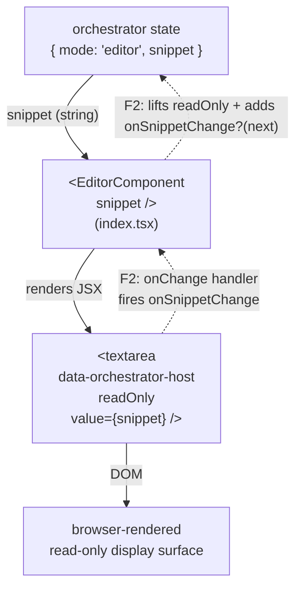

# editor — Architecture & Decisions

## Why this module exists

`orchestrate/editor/` is the orchestrator's **home base** — the always-mounted
React surface where learners edit the snippet string. Per the locked
single-writer state model in [`../README.md`](../README.md) § Conventions and
[`../DOCS.md` § Why the editor is a peer subdir, not a lens](../DOCS.md), this
is the only surface in the package that mutates snippet source. Lenses, the
recommender, and the toolbar picker are all read-only.

The editor is **not** a `LensModule`. It is **not** registered in the lens
registry. The orchestrator's editor-mode UI mounts [`./index.tsx`](./index.tsx)
directly as a peer React component; when the orchestrator transitions to lens
mode it unmounts the editor and mounts a `<LensModule.Component>` instead (per
[`../DOCS.md` § Lifecycle modes](../DOCS.md)). The two surfaces never co-render.

## Single-component module

| File        | Purpose                                                                                |
| ----------- | -------------------------------------------------------------------------------------- |
| `index.tsx` | React home-base component (default export). Renders the read-only host textarea in F1. |

The previous draft of this DOCS framed the editor as a two-layer "React
adapter + LensModule stub" module. AR-1 rejected that framing: the post-refactor
`LensModule` contract (per [`../../lenses/types.ts`](../../lenses/types.ts)
lines 186-192) requires `Component` + `applicableTo` fields, which the
pre-refactor stub lacked. The home base is a single React component; the legacy
stub at `./editor.ts` was deleted as part of F1.C.

## Architectural sketch

### Data flow

The dotted edges are **F2 only** — F1 ships read-only display because there is
no path for edits to reach the orchestrator's snippet state. F2 lifts the
`readOnly` attribute and adds the `onChange` handler that fires
`onSnippetChange?`.

### Execution phases

1. **Mount** — orchestrator is in editor mode; renders
   `<EditorComponent snippet={…} />`. The component returns its JSX body
   containing `<textarea data-orchestrator-host value={snippet}>`. React mounts
   the textarea natively. No `useRef`-managed DOM mount, no manual
   `appendChild`.
2. **Re-render on snippet change** — when the orchestrator passes a new
   `snippet`, React reconciles the textarea's `value` attribute. No teardown /
   re-mount; React's standard reconciliation handles it.
3. **(F2 onward) Mode transition (editor → lens)** — orchestrator switches
   `state.mode` to `'lens'`. React unmounts `<EditorComponent>` entirely and
   mounts `<LensModule.Component>` in its place. Any `useEffect` cleanups inside
   the editor run as part of the unmount. F1 has no mode discriminator, so this
   transition does not fire in F1.
4. **(F2 onward) Mode transition (lens → editor)** — symmetric. React unmounts
   the lens and mounts a fresh `<EditorComponent>`. Editor-internal state
   (cursor position, scroll) is per-mount; nothing carries across. Same F1-vs-F2
   caveat as step 3.

### Structural constraints

- **Read-only in F1.** The textarea uses `readOnly` and a controlled
  `value={snippet}`; learners see the snippet but cannot type into it because F1
  has no path for edits to reach the orchestrator's snippet state. F2 lifts the
  `readOnly` attribute and adds an optional
  `onSnippetChange?(next: string) => void` prop with a matching `onChange`
  handler on the textarea; the orchestrator routes that callback into its
  `useState` setter for snippet.
- **No `embodiment` prop on the editor — ever.** The editor is editor-mode-only.
  Per [`../DOCS.md` § Lifecycle modes](../DOCS.md) (lines 82-84) and the F2
  handoff (lines 325-327 of
  [`../../.planning-handoffs/03-orchestrator-and-contracts.md`](../../.planning-handoffs/03-orchestrator-and-contracts.md)),
  editor mode has no embodiment built. Embodiment is a lens-mode concept and is
  passed to `<LensModule.Component>`, not to this editor.
- **No `LensModule` registration.** The editor is not enumerated by the picker,
  not ranked by the recommender, not present in the lens registry. The
  orchestrator imports the component directly.
- **Sync mount today.** The F1 placeholder is a synchronous JSX body — no async
  setup, no `Promise<…>` mount API. Inc 15+'s CodeMirror replacement may need
  async language-module loading; that async lives **inside the component**
  (`useEffect` + `React.lazy` + `<Suspense>`) and does not change the prop
  contract.
- **Single host element.** The component renders **one**
  `<textarea data-orchestrator-host>` directly. The data attribute is the test /
  dev-sandbox handle for "this is the home base surface". (If Inc 15+ needs to
  wrap CodeMirror in a containing `
`, the data attribute moves to whichever
  element is the outermost stable handle.)

### Out of scope

- **Edit propagation** — F2 adds `onSnippetChange?`.
- **Embodiment-aware diagnostics** — the editor never receives an embodiment.
  CodeMirror in-editor diagnostics (Inc 15+) will consume `validation.*` /
  `errors.*` from a `Snippet` only if a future contract change passes the
  embodiment in lens mode (out of scope for the editor itself).
- **Recommend-time analysis** — the editor is not a lens; it has no
  `recommend()` surface. Recommendations belong to lens modules.

## Replacement contract

The CodeMirror-backed home base (Inc 15+) MUST keep:

- **Same file path:** [`./index.tsx`](./index.tsx).
- **Same default export shape:** a React function component.
- **Same prop surface:** `{ snippet }` in F1; `{ snippet, onSnippetChange? }`
  from F2 onward.
- **Same data attribute on the host element:** `data-orchestrator-host`.

When CodeMirror lands the orchestrator's call site does not change. The
component's internal implementation swaps from a plain `<textarea>` body to a
CodeMirror `EditorView` mounted via `useEffect`; everything outside the
component is invariant.

## Module ownership

This module owns:

- [`./index.tsx`](./index.tsx) — the React home-base component.

Consumers:

- [`../index.tsx`](../index.tsx) — the orchestrator imports the component for
  editor mode.

No other consumers. Lenses do not consume the editor; the recommender does not
consume it; the toolbar does not consume it.

## Future direction

When the CodeMirror replacement lands (Inc 15+):

- A dedicated unit test directory at [`./tests/`](./tests/) returns with
  isolated coverage of the React component (the orchestrate-level tests at
  [`../tests/study-lenses.test.tsx`](../tests/study-lenses.test.tsx) cover F1's
  behavior end-to-end; isolated tests gain value once CodeMirror's surface area
  expands the component beyond a 3-line JSX body).
- The component body switches from a `<textarea>` JSX child to a
  `
` plus a `useEffect` that
  constructs `new EditorView({ parent: hostRef.current, … })` and returns its
  `destroy()` as the effect cleanup.
- F2's `onSnippetChange?` wiring becomes a CodeMirror update listener that
  debounces and dispatches.
- This DOCS.md grows a "CodeMirror integration" section describing the extension
  stack and the `validation.*`-driven diagnostics linter.
