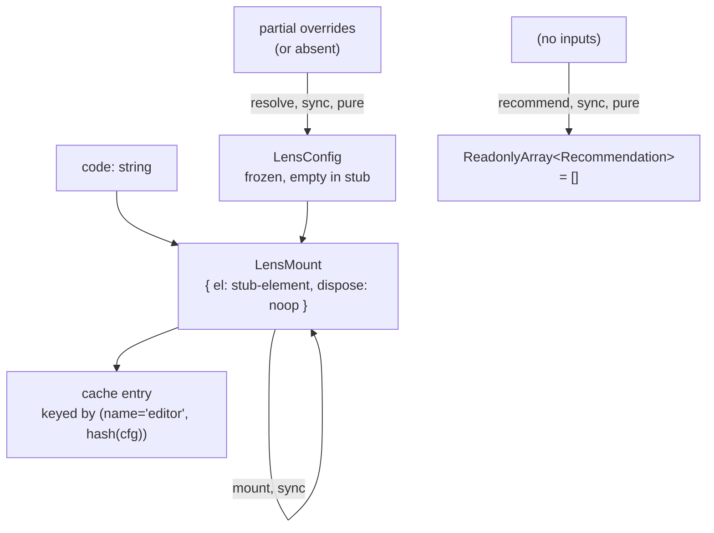

# editor — Architecture & Decisions

## Why this module exists

The `editor` lens is the default landing lens for `js:editor` fences
and the orchestrator's fallback when an unknown lens name is
requested. Pipeline validation in
[`../../pipeline.ts`](../../pipeline.ts) rewrites unknown lens names
to `'editor'` with a console warning, so this module **must** stay
registered.

The eventual real implementation is a CodeMirror-backed editable code
surface. Today this directory ships a stub.

## Why a stub

Increment 8 ships the React orchestrator scaffolding. Wiring
mount/detach, async cancellation, and the lens cache requires a
concrete `LensModule` to register and resolve. Building the real
CodeMirror lens at the same time as the orchestrator scaffolding
would overload the increment; the stub is the smallest substitute
that satisfies the contract:

- It has the correct default-export shape (frozen `LensModule`).
- It returns a real `LensMount` (`el` + `dispose`) — not a Promise.
- It fills the unknown-name fallback role without console errors.

What the stub does NOT do: parse, format, dispatch
`snippet-changed`, or persist edits. Those arrive with the
CodeMirror replacement in Increment 15+.

## Replacement contract

The real CodeMirror lens MUST keep:

- Same file path: [`./editor.ts`](./editor.ts).
- Same default export: a frozen `LensModule`.
- Same `name` field: `'editor'`.
- Same backwards-compatible `lens(code, cfg)` signature; may switch
  the return type from `LensMount` to `Promise<LensMount>`.

The orchestrator does not need to change when the swap happens. The
stub-vs-real difference is observable only through the `data-lens`
attribute (today `"editor-stub"`; the real lens picks its own value,
e.g. `"editor-codemirror"`).

## Architectural sketch

### Execution phases

1. **Mount** (sync today, may become async post-replacement) — create
   a single detachable element, populate it with the snippet text,
   return a `LensMount` whose `dispose()` is a no-op. Increment 9
   Pre-work C-1 changes the element from `<pre>` to `<textarea>` so
   learners can type into it; edits remain non-propagating until the
   real lens lands.
2. **Config resolution** — accept partial overrides; spread + freeze;
   cast back to `LensConfig`. The stub has no configuration surface.
3. **Recommend** — return an empty array. The real CodeMirror lens
   will populate this once the analysis pipeline lands per
   [`../../../.planning-handoffs/02-analysis-and-recommender.md`](../../../.planning-handoffs/02-analysis-and-recommender.md).

### Data flow

The "stub-element" node is `<pre data-lens="editor-stub">` today and
becomes `<textarea data-lens="editor-stub">` after Increment 9
Pre-work C-1. The replacement (Increment 15+) returns CodeMirror's
`EditorView.dom` element and the mount edge gains an `async` constraint;
the rest of the contract above is unchanged.

### Structural constraints

- **No React import.** This file is pure TypeScript. The replacement
  may use `createRoot` internally if it picks a React-driven editor,
  but the boundary stays inside this file.
- **`dispose()` is owned by the lens.** The orchestrator calls it on
  unmount and on cache eviction; the lens decides what cleanup means
  (CodeMirror: `editorView.destroy()`; stub: no-op).
- **No `snippet-changed` dispatch in the stub.** Edits inside the
  textarea (post-Pre-work-C-1) are visible but not propagated to the
  orchestrator. The real lens implements debounced dispatch.
- **Cache survival across switch.** When the orchestrator caches an
  `editor`-stub mount and reattaches it later, any text the learner
  typed survives because the DOM node was detached, not destroyed.
  This survival behavior is the whole reason the
  switch-cleanup-vs-unmount-cleanup split (Increment 9 Pre-work B)
  matters for this lens.

### Out of scope

- **Edit propagation.** Stub-only. Belongs to the real lens.
- **Syntax error handling.** Stub renders the snippet verbatim; no
  parse, no validation. The `lib/validating/` module handles parse
  errors; the real lens consumes that report.
- **Recommend-time analysis.** Stub returns `[]`. The real lens
  consumes the analysis report from `lib/analysis/` (TBD).

## Why `<textarea>` instead of `<pre>` for the upgraded stub

Increment 9 needs a second lens to switch between, and the user wants
the stub semantically aligned with its eventual replacement. The real
CodeMirror editor is editable; a textarea is the simplest DOM element
that conveys "type here" without pulling in CodeMirror. It contrasts
visually and behaviorally with the read-only `<pre><code>` of the
[`../highlight/`](../highlight/) stub (planned, Increment 9 Pre-work
C-2).

## Module ownership

This module owns:

- [`./editor.ts`](./editor.ts) — the `LensModule` default export.
- [`./tests/editor.test.ts`](./tests/editor.test.ts) — vitest jsdom
  unit tests.

Consumers:

- [`../../orchestrator/default-registry.ts`](../../orchestrator/default-registry.ts)
  imports the default and registers it.
- The orchestrator wrapper at
  [`../../orchestrator/study-lenses.tsx`](../../orchestrator/study-lenses.tsx)
  resolves it through `registry.getLens('editor')`.

No other consumers. The replacement (Increment 15+) keeps the same
import surface.

## Future direction

When the CodeMirror replacement lands:

- This DOCS.md grows a "CodeMirror integration" section describing
  language extensions, theme wiring, and the `EditorView.destroy()`
  cleanup contract.
- The data-flow diagram's mount edge changes from sync to async
  (`Promise<LensMount>`).
- The "no `snippet-changed` dispatch" structural constraint flips —
  the real lens MUST dispatch debounced edits.
- The `recommend()` empty-array short-circuit becomes a real
  Block-Model placement function consuming the analysis report.
