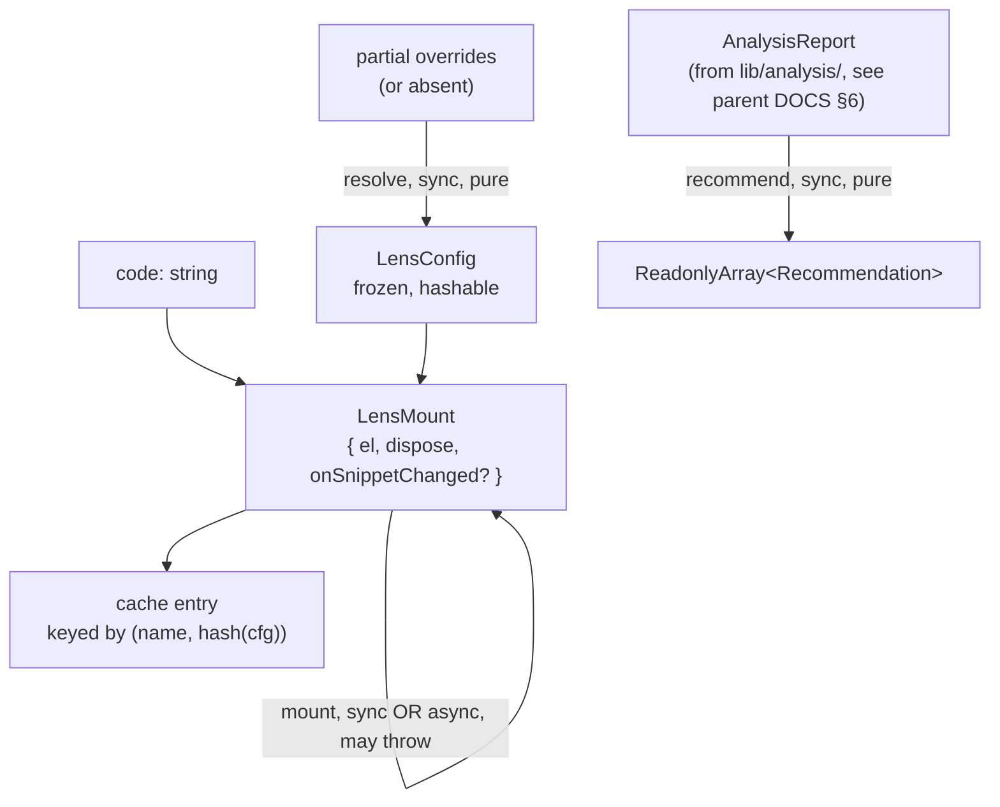

# lenses — Architecture & Decisions

## Why this module exists

The `lenses/` directory is the bounded context for **terminal pipeline
modules** — those that turn a code string into a renderable component.
Concentrating all lens implementations in one directory (instead of
threading them through the orchestrator) means:

- The orchestrator never imports a specific lens. It depends only on
  the registered set, looked up by name through `Registry.getLens`.
- Adding a new lens is one file (`<name>/<name>.ts`) plus one
  `registry.register(...)` line in
  [`../orchestrator/default-registry.ts`](../orchestrator/default-registry.ts).
- Replacing a lens (stub → real) is a same-path same-shape swap, with
  zero orchestrator-side changes.

Lens modules are intentionally **pure TypeScript** (no React import).
Each lens returns a `LensMount` — a framework-agnostic detachable DOM
handle — so the React orchestrator stays the only React surface.

## Architectural sketch

> Written Phase 0, before implementation of additional lenses. The
> Refactor step of each lens's Phase 1 is held against this sketch.
> Domain terms only; no function names, no variable names, no
> pseudocode.

### Execution phases (per lens)

1. **Resolve config** (sync, pure) — caller passes optional overrides;
   the lens's `config(overrides?)` merges them over module defaults
   and returns a frozen `LensConfig`. Hashable — no callbacks, no
   class instances, no dates.
2. **Mount** (sync OR async) — `lens(code, cfg)` produces a
   `LensMount`: `el` (a detachable HTMLElement), `dispose()`
   (cleanup), and optional `onSnippetChanged(snippet)` (IoC hook for
   external snippet updates). Returns synchronously or as a Promise;
   the orchestrator awaits either form.
3. **Recommend** (sync, pure, NOT part of mount) — `recommend(analysis)`
   consumes a snippet analysis report and returns zero or more
   `Recommendation` objects placed on the 3D Block Model grid.
   Independent of mount; called only when the recommender panel
   opens.

### Data flow

The diagram is per-lens. Edges are transformations; nodes are the
data states they produce. Three lanes meet through `LensConfig`
(consumed by mount) and the cache key (consumed by the orchestrator).
The recommend lane is genuinely independent — `recommend()` is NOT
part of mount, per the structural constraint below.

The cache and the snippet store are upstream — see
[`../DOCS.md`](../DOCS.md) §3 Cache.

### Structural constraints

- **Terminal.** Exactly one lens per pipeline. Build-time validation
  rejects multi-lens fences.
- **Unique name across the registry.** Names share a keyspace with
  transforms — `loopGuard` (transform) and `editor` (lens) cannot
  collide.
- **Pure TypeScript.** Lens module files import no React. The React
  wrapper lives in [`../orchestrator/`](../orchestrator/). Lenses
  producing React trees expose them through their `mount.el`
  whose contents the orchestrator does not introspect.
- **Self-describing.** Each lens's `recommend()` returns its own
  Block-Model placements; the recommender never reaches into a
  lens's internals.
- **Async permitted, but bounded.** `lens()` may return a Promise (for
  lenses that lazily load heavy dependencies). The orchestrator
  cancels in-flight mounts on unmount and disposes the resolved mount
  rather than attaching it — **but only for fresh mounts**; cached
  entries that resolve mid-cancel remain owned by the cache and are
  not disposed at the cancel site.
- **`onSnippetChanged` is optional.** Lenses that omit the hook have
  the cached mount surface a stale-state affordance on next reattach
  (orchestrator's responsibility, not the lens's).

### Out of scope

- **Cross-lens communication.** Lenses do not import each other. Any
  shared logic moves into a domain-agnostic utility under `lib/`.
- **Cache eviction.** Each lens trusts the orchestrator's
  `(name, config-hash)` cache strategy; lenses do not own eviction
  policy.
- **Snippet ownership.** The orchestrator holds the canonical snippet.
  Lenses receive it on mount and again via `onSnippetChanged` on
  external changes; they never reach back through a global to read
  it.

## Why pure-TS lens modules

The orchestrator's React layer is a wrapper around a pure-TS substrate
(registry, pipeline, state factory, EventBus, lens cache). Lenses
participate in that substrate at the same level — they're values
registered in a frozen `Registry`, called from a `useEffect`, and
cached as plain DOM handles. Threading React imports into lens module
files would couple every lens to the wrapper and prevent vitest
testing of mount behavior without `@testing-library/react`. A lens
that internally uses React renders into its `mount.el` via
`createRoot(el).render(...)`; the React boundary lives inside that
single file, not across the lens contract.

## Why a `recommend()` per lens

The Block Model grid is populated by asking each lens to describe its
own relevance for a given snippet, given an analysis report. This
inverts the alternative — a centralized recommender that knows lens
internals — which would accumulate every lens's edge-case logic in
one file and break the orchestrator-doesn't-import-specific-lenses
invariant.

## Module ownership

Each lens subdir owns its source, tests, README, and DOCS.
Collection-level concerns — naming, registry hookup, mount/detach
contract, tier classification — are documented here and in
[`../README.md`](../README.md) §Module shape. Cross-lens decisions
appear here so each lens's own DOCS can refer to a single source of
truth.

## Future direction

- The "stale-state affordance" surfaced on reattach (per
  [`../DOCS.md`](../DOCS.md) §3 Cache) is currently a per-lens
  responsibility. A shared reattach-affordance helper may move into
  this directory (or into a domain-agnostic utility) once the second
  real lens lands.
- The `recommend()` protocol may grow a tier-aware default helper
  (e.g. `relevanceFromTier(analysis, tier)`) once enough lenses ship
  to surface a common pattern.
