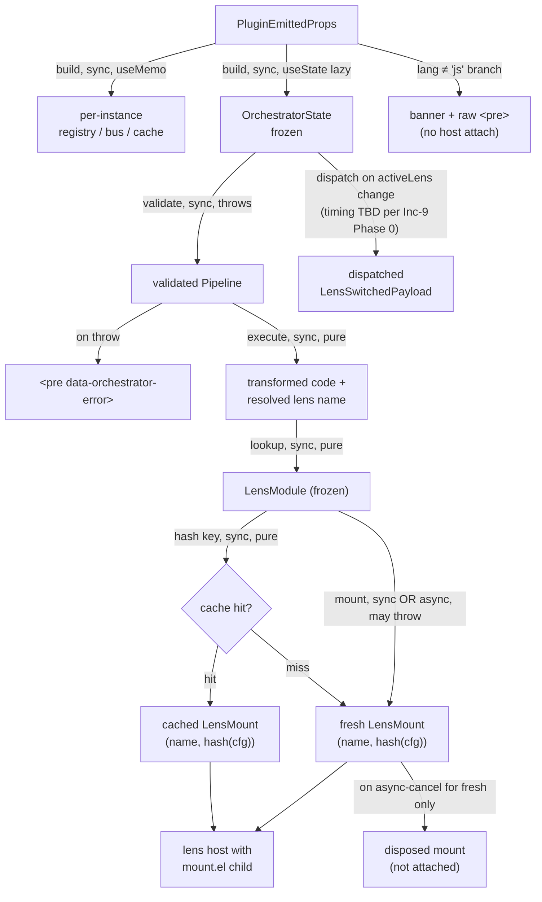
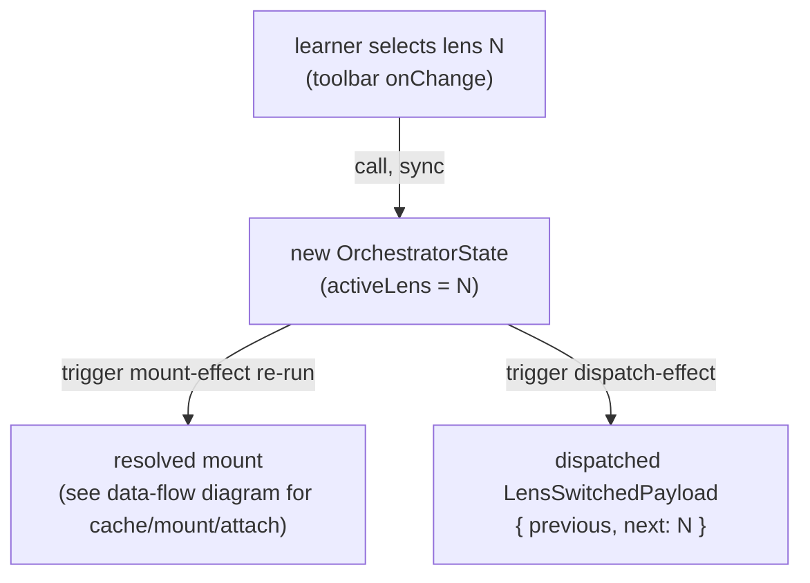

# orchestrator — Architecture & Decisions

## Why this module exists

The `orchestrator/` directory is the React seam between the
study-lenses Phase-1 pure-TS substrate (registry, pipeline,
orchestrator state, EventBus, lens cache) and the Docusaurus swizzle
(`MDXComponents.tsx`). Concentrating the React wiring in one
directory keeps every other study-lenses module pure TypeScript —
testable in vitest without `jsdom`, runnable in node-only contexts,
free of React-as-dependency creep.

The wrapper component, `<StudyLenses>`, is the only React-aware
surface in this system. Everything else (transforms, lenses, registry,
pipeline, EventBus, lens cache, state factory) is pure TS that the
wrapper composes via hooks.

## Bounded context

| Inside this directory                                    | Elsewhere                                                                       |
| -------------------------------------------------------- | ------------------------------------------------------------------------------- |
| `<StudyLenses>` React component (mount / dispatch / unmount effects) | The substrate it wraps lives one level up                              |
| Default registry assembly (`createDefaultRegistry`)      | Individual lens / transform modules live in `../lenses/` and `../transforms/`   |
| Toolbar (Increment 9+) — lens-picker, transforms, reset, recommender, snippet name | The state mutations the toolbar triggers go through the existing `setState` seam |
| `<BrowserOnly>` SSR boundary                             | The plugin emits `<StudyLenses>` JSX nodes; it does not render them              |
| Per-instance registry / bus / cache **lifecycle**        | Per-instance state factory + EventBus + lens cache **factories** live one level up |

## Architectural sketch

> Written Phase 0, expanded incrementally. The Refactor step of each
> Increment-9+ TDD increment is held against this sketch. Domain terms
> only — no function names, no variable names, no pseudocode.

### Execution phases

The `<StudyLenses>` lifecycle is three phases (initial mount, switch,
unmount), implemented across three named `useEffect`s post-Increment-9.

#### Phase 1: Initial mount

1. **Build per-instance handles** (sync, `useMemo`) — registry, bus,
   cache. Stable across re-renders so subsequent effects can capture
   them.
2. **Build initial state** (sync, `useState` lazy initializer) —
   freeze a fresh `OrchestratorState` from the props, with `snippet =
   originalCode` and `activeLens = initialLens`.
3. **Resolve and attach** (sync OR async, mount-effect) — validate
   pipeline → execute pipeline → resolve lens module → call
   `lens(code, cfg)` (await if Promise) → attach `mount.el` to the
   host ref. A cancellation flag inside the effect closure protects
   against unmount-mid-flight.

#### Phase 2: Switch (Increment 9+)

The lens-picker dropdown calls back into the wrapper with a target
lens name. The wrapper applies the transition through the existing
`setState` seam:

1. **State transition** (sync) — `setState` produces a new frozen
   `OrchestratorState` whose only diff is `activeLens`. The new state
   identity triggers the mount-effect.
2. **Detach** (sync, mount-effect cleanup) — remove the previously
   attached `mount.el` from the host. **Do not dispose.** The cached
   entry survives so the orchestrator can reattach it on a future
   switch-back.
3. **Reattach OR fresh mount** (sync OR async, mount-effect body) —
   `cache.get(name, cfg)` → cache hit reattaches the existing
   `mount.el`; cache miss runs `lens(code, cfg)` and `cache.set(name,
   cfg, mount)`.
4. **Dispatch** (sync, separate dispatch-effect) —
   `bus.dispatch('lens-switched', { previous, next })` fires from a
   second `useEffect` whose dep is `[state.activeLens, bus]` and
   whose body uses a `useRef`-held previous-lens value to suppress
   the first-mount case. The exact dispatch ordering relative to
   attach is one of the open Phase-0 design questions for Increment
   9 — see
   [`../../.planning-handoffs/03-orchestrator-and-contracts.md`](../../.planning-handoffs/03-orchestrator-and-contracts.md).
   This document is updated to the resolved choice during Increment
   9 Phase 0.

#### Phase 3: Unmount

A dedicated unmount-cleanup effect (empty deps, captures stable
registry / bus / cache by closure) runs once on real component
unmount:

1. `bus.clear()` — drop every subscription.
2. `cache.visit(entry => entry.mount.dispose())` — call dispose on
   every cached lens.
3. `cache.clear()` — drop every entry.

This sequence runs **only on unmount**, never on state-driven effect
re-runs. That separation is what lets the cache survive across
switches (Phase 2 step 2 detaches without disposing).

### Data flow

The diagram covers the happy path (Mount + Switch) and three failure
modes (lang ≠ js banner; validation throw; async-cancel-of-fresh-mount).
The dispatch edge is intentionally drawn from `State` rather than
from `Attached`: the timing relative to attach is one of the open
Phase-0 design questions for Increment 9, so the source of the edge
is "the state change that triggered it" rather than a particular
sequencing point. Phase 0 will pin the edge to its real source.

### Switch flow

This subsection is the canonical reference for Increment-9 toolbar
behavior. Anchor: `§Switch flow`. The data-flow diagram above covers
the cache-resolve / mount / attach machinery; this diagram is scoped
to the **user-trigger seam and the dispatch sequencing question**
that the data-flow diagram intentionally elides.

The two trigger edges from `Transitioning` fire on the same React
commit. Their **observable order** at listeners is the open Phase-0
design question:

- **If dispatch-effect runs after mount-effect attach** (current
  default in this sketch): listeners observe `Dispatched` AFTER
  `Mounted`'s `el` is in the DOM.
- **If in-handler synchronous dispatch is chosen instead**: the
  `Dispatched` edge collapses to fire from `userSelect` directly,
  before the React commit, and listeners observe it BEFORE
  `Mounted`.

Increment 9 Phase 0 picks one and updates this diagram and the prose
in §Phase 2 step 4 to match.

### Effect topology

Three named `useEffect`s, each with a single responsibility. The
**Cleanup work** column is the load-bearing distinction — splitting
detach (every re-run) from dispose (unmount only) is what makes
cache-hit reattach work.

| Effect              | Deps                                        | Cleanup runs on                              | Cleanup work                                              | Purpose                                                                          |
| ------------------- | ------------------------------------------- | -------------------------------------------- | --------------------------------------------------------- | -------------------------------------------------------------------------------- |
| `mountActiveLens`   | `[state, registry, bus, cache, langOk]`     | every effect re-run AND on unmount           | detach `mount.el` from host (NO dispose); set cancel flag | Resolve the active lens, attach `mount.el`. Cache survives across switch.        |
| `dispatchSwitch`    | `[state.activeLens, bus]` (Increment 9+)    | on `state.activeLens` change AND on unmount  | none (pure dispatch effect)                               | Fire `bus.dispatch('lens-switched', ...)` after a real switch. First-mount suppressed via ref. |
| `disposeOnUnmount`  | `[bus, cache]`                              | on unmount only                              | `bus.clear`; `cache.visit(dispose)`; `cache.clear`        | Owns full teardown — runs once, on real unmount only (Increment 9 Pre-work-B split). |

Splitting the cleanup across two effects (mount-effect retains
detach-without-dispose; unmount-effect owns the full teardown) is
what makes cache-hit reattach work across state-identity changes.
React fires both on real unmount in registration order (last
registered runs first), so the unmount sequence is: detach →
`bus.clear` → cache-dispose-all → `cache.clear`. No ordering
guarantees are required between the mount-effect cleanup's detach
and the unmount cleanup's dispose because dispose is safe to call on
a detached element.

### Structural constraints

- **`<BrowserOnly>` boundary.** Server-render produces
  `<pre>{code}</pre>`; no orchestrator wiring runs on the server.
- **Per-instance isolation.** Each `<StudyLenses>` instance owns its
  own registry, bus, cache, and state. Two instances on the same
  page do not share state.
- **`
` is the lens host
  only.** Increment 9 wraps it in an outer
  `
` that also contains the toolbar;
  existing tests selecting on the inner host attribute continue to
  pass.
- **Lang ≠ js short-circuits before any substrate work.** No
  validation, no execution, no lens resolution.
- **Validation failure is a render-side error fallback,** not an
  uncaught exception. The error-boundary contract sits inside the
  effect's try/catch.
- **Cancellation flag is per effect run.** A new effect run resets
  it to `false`; the previous run's cleanup sets the previous
  closure's flag to `true`.

### Out of scope

- **Pipeline construction at runtime.** The plugin parses fence
  syntax at build time and emits `transforms` + `lens` props. The
  orchestrator only validates and executes.
- **Lens internals.** The orchestrator never inspects the contents
  of `mount.el`. Lenses own everything inside the box.
- **Snippet analysis and recommendation.** Lives in `lib/analysis/`
  and `lib/recommender/` (TBD); the orchestrator consumes them
  through `recommend()` calls only when the recommender panel is
  opened (Increment 14).
- **Persistence.** No localStorage, no URL state. Per-instance
  in-memory only.

## Why split the cleanup across two effects

The Increment-8 wrapper had a single mount-effect whose cleanup ran
both detach and dispose-everything. For an unmount-only lifecycle
this is correct. For a switch lifecycle it is catastrophic: every
state-driven effect re-run would dispose the cache it was about to
read from, defeating the whole `(name, config-hash)` reattach
strategy.

Two named effects make the responsibility split explicit at the
source level: `mountActiveLens.cleanup` only undoes what its body
did this run; `disposeOnUnmount.cleanup` undoes everything once. The
split is a behavior-preserving refactor for the existing test suite
because async cancel still uses the per-effect closure flag and real
unmount still runs the full dispose sequence — just from a
different effect.

## Why a separate dispatch-effect (rather than dispatching in the handler)

Two reasons:

1. **Coverage of every switch.** A handler-only dispatch fires only
   from `onLensChange`. Future call sites — recommender selection
   (Increment 14), Reset All (Increment 12) — would each have to
   remember to dispatch. A dispatch-effect on `[state.activeLens]`
   covers every state mutation that changes the active lens, no
   matter who triggered it.
2. **Ordering with mount.** A handler-side dispatch fires before the
   React state commit. A dispatch-effect fires after the
   mount-effect re-run, so listeners observe the new mount as
   already attached. [`../DOCS.md`](../DOCS.md) §4 (Switch) describes
   `lens-switched` as fired after the new lens is mounted; the
   dispatch-effect places the call correctly without a
   synchronization dance.

The trade-off: the dispatch-effect needs a `useRef`-held previous-lens
value to suppress first-mount dispatch. That bookkeeping is contained
inside this directory.

## Module ownership

This module owns the React seam, the default-registry assembly, and
(post Increment 9) the toolbar component. It does NOT own:

- The substrate it wraps — see [`../README.md`](../README.md) and
  [`../DOCS.md`](../DOCS.md).
- Specific lens or transform implementations — see
  [`../lenses/`](../lenses/) and
  [`../transforms/`](../transforms/).
- The plugin's MDAST → JSX transformation — that lives outside
  `study-lenses/` entirely (in
  `src/plugins/study-lenses/`).

## Future direction

- Increments 10–14 add toolbar buttons (transform toggles, Reset,
  Reset All, snippet name, recommender). Each is a new prop or
  callback on the toolbar component; none change the effect
  topology.
- A future increment may extract the per-effect cleanup discipline
  into a `useStudyLensesLifecycle()` custom hook. That extraction is
  deferred until the third callback site appears (per AGENTS.md
  §Within-file helpers).
