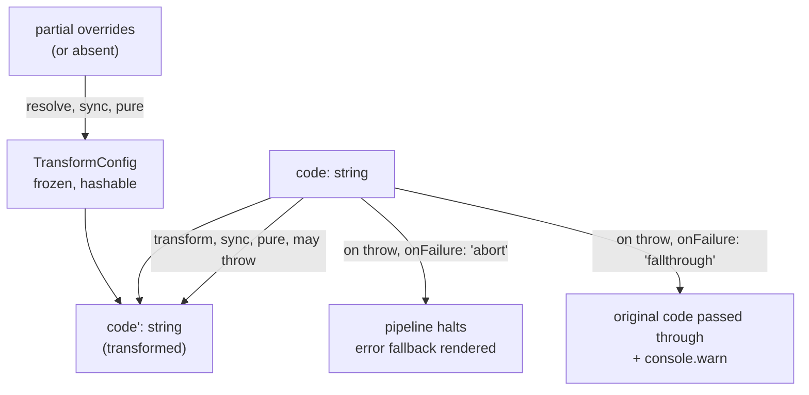

# transforms — Architecture & Decisions

## Why this module exists

The `transforms/` directory is the bounded context for **non-terminal
pipeline modules** — those that turn a code string into a different
code string. Splitting transforms into their own directory (separate
from `lenses/`) makes the type-level separation visible at the
filesystem level and keeps the pipeline's "zero-or-more transforms,
exactly one terminal lens" invariant readable from the project tree.

Today the directory is empty. The first transforms (`format`,
`loopGuard`, `translate`) land during WS4 lens migration per
[`../../.planning-handoffs/04-lens-migration.md`](../../.planning-handoffs/04-lens-migration.md).

## Architectural sketch

> Written Phase 0, before any transform module exists. The Refactor
> step of each transform's Phase 1 is held against this sketch.
> Domain terms only.

### Execution phases (per transform)

1. **Resolve config** (sync, pure) — `config(overrides?)` merges
   caller overrides over module defaults; returns a frozen
   `TransformConfig`.
2. **Transform** (sync, pure, may throw) — `transform(code, cfg)`
   returns the transformed code string. On throw the orchestrator
   applies the module's declared `onFailure` mode (see structural
   constraints below).

Failure handling is NOT a third phase — it is a structural property
of Phase 2 governed by the declared `onFailure` mode. Listing it as a
separate phase would imply a separate data transformation; in fact
it is a control-flow branch on Phase 2's outcome.

### Data flow

The diagram is per-transform. Pipeline composition (chaining multiple
transforms before a terminal lens) is handled by
[`../execute-pipeline.ts`](../execute-pipeline.ts) and is not the
transform's concern.

### Structural constraints

- **Pure, synchronous, string-to-string.** No DOM, no React, no
  async, no global state. Testable in vitest **without** `jsdom` —
  the most load-bearing constraint that distinguishes transforms
  from lenses.
- **Configs are hashable.** `TransformConfig` is restricted to
  primitives + readonly arrays of primitives so cache keys hash
  deterministically. The lens cache hashes the lens config, not
  upstream transform configs; the result of `executePipeline` is
  passed to the lens directly.
- **Failure is declared, not implicit.** Every transform that may
  fail declares `onFailure: 'abort'` (default) or
  `onFailure: 'fallthrough'`. The orchestrator does not infer the
  mode from heuristics.
- **Names are unique across registry.** Transform and lens names
  share a keyspace; `format` (transform) and `editor` (lens) cannot
  collide.

### Out of scope

- **AST-level transforms with shared parsers.** Transforms parse and
  serialize internally — they do not exchange ASTs. A transform that
  needs an AST imports `lib/parse-old/parse.js` and converts back to a
  string before returning.
- **UI affordances for transform results.** Transforms produce code,
  not components. UI is the lens's responsibility.
- **Pipeline ordering or composition.** Order is decided by the
  pipeline prop / fence syntax; this directory only defines the
  per-transform contract.
- **Transform discovery / hot reload.** Registration is static at
  module-load time, same as lenses.

## Why empty today

Phase 1 of WS3 prioritized the pure-TS substrate (registry, pipeline,
state factory, EventBus, lens cache) and Increment 8 prioritized the
React orchestrator scaffolding. Adding a transform now would expand
the scaffolding's footprint without exercising it — the orchestrator's
pipeline-execute path is already covered by tests using the substrate
alone, with `transforms: []`. The first transform module lands when
WS4 needs it.

## Why `format` is `'fallthrough'` and others are `'abort'`

The default failure mode is `'abort'` because most transform failures
indicate a real bug in the input — a parse failure, an invalid
configuration. Rendering a diagnostic banner is the right learner
experience for those cases.

`format` is the exception. A formatter failure (Prettier choking on
exotic syntax, unsupported language version) is purely cosmetic — the
unformatted code is still safe to study. Falling through with a
console warning preserves the lesson at the cost of the formatting
polish.

`loopGuard`: `'abort'` is correct — a failure to wrap the snippet's
loops with the runtime safeguard means the unwrapped code may run
away and crash the page.

`translate` (JS ↔ pseudocode): `'abort'` — a translation failure
means the rewrite did not apply, and showing untranslated JS in a
pseudocode-only context defeats the lens.

## Module ownership

This module owns:

- The transform contract (`TransformModule`, `TransformConfig`,
  `TransformFailureMode`) — defined in [`../types.ts`](../types.ts).
- Transform implementations — one subdirectory per module, when they
  land.

This module does NOT own:

- Pipeline execution — that lives in
  [`../execute-pipeline.ts`](../execute-pipeline.ts).
- Pipeline validation — that lives in
  [`../pipeline.ts`](../pipeline.ts).
- The `Pipeline.configs` keyspace — flat keyed-by-module-name; lives
  on the `Pipeline` type and is documented in
  [`../DOCS.md`](../DOCS.md) §Structural constraints (Configs flow
  by module name).

## Future direction

- The first transforms land in WS4 lens migration. Each gets its own
  subdirectory with its own README + DOCS at that time.
- A `lib/`-level utility for "transform that wraps a parser +
  serializer pair" may emerge once two transforms (likely `format`
  and `loopGuard`) have shipped and the pattern is concrete.
