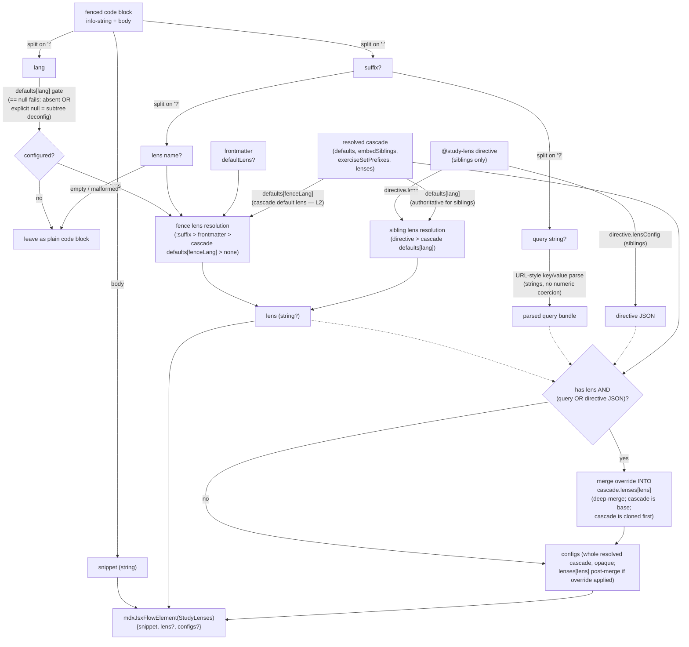

# `study-lenses` — Architectural Sketch

> Written Phase 0, before implementation. The Refactor step is held against this
> document — not what the code does, but what shape it takes. No function names,
> no variable names, no pseudocode.

The plugin exposes three build-time plugin surfaces, each firing at a different
point in Docusaurus's lifecycle: a **remark transformer** that Docusaurus
invokes once per markdown/MDX file during compilation; a **lifecycle plugin**
that contributes watched-path globs during plugin init so the dev server
invalidates when lens config or sibling files change; and a **sidebar-items
generator factory** the author wires into each docs instance during config load
to rewrite exercise-set category labels at sidebar-build time.

## Execution phases

### Remark transformer

1. **Guard** (sync; silent skip) — reject the invocation when the input file has
   no path, or when the file sits outside the configured content root. No
   mutation, no error; the markdown is returned unchanged.

2. **Resolve** (sync; cached) — obtain the resolved configuration for the file's
   directory via the cascade resolver. Input: the file's directory. Output: a
   fully-populated, deep-frozen configuration structure.

3. **Transform fenced code blocks** (sync; in-place AST mutation) — for every
   fenced code block whose language identifier is present in the resolved
   configuration's `defaults` (a **configured language**), rewrite the node in
   place so that downstream rendering produces the plugin's React component.
   Fences whose language is absent from `defaults` are left untouched and fall
   through to Docusaurus's default rendering.

   **Suffix parsing (URL-style):**
   - Split the info string on `:` → `[lang, suffix]`.
   - If `suffix` is absent (bare `js`): the `lens` prop is populated by the
     **default-lens precedence chain** — frontmatter `defaultLens` first,
     then (when no frontmatter) cascade `defaults[fenceLang]` as the
     **cascade default lens**. When neither frontmatter nor the cascade
     entry resolves a lens, the bare-fence emission carries no `lens`
     attribute; the orchestrator falls back to the editor home base. (L2
     reverses prior locked-decision-1; the cascade default lens is now
     the fence-side third tier.)
   - If `suffix` is present: split on `?` → `[lensName, query]`. Empty
     `lensName` → leave fence untouched (malformed). Otherwise `lensName`
     populates the `lens` attribute.
   - If `query` is present: parse as URL-style key/value pairs joined by `&`.
     Each `key=value` becomes a string in the parsed config bundle;
     `key=v1,v2,…` becomes an array of strings (comma-split); `key` (no `=`)
     becomes boolean `true`; `key=` (empty value) becomes empty string `""`.
     **No numeric coercion at parse time** — every value is a string or array of
     strings. Lenses coerce at config-read time as needed.
   - The parsed query is **deep-merged INTO** the cascade's `lenses[lens]` entry
     (cascade wins as base; query overrides). The merged entry rides inside the
     whole-cascade `configs` attribute — there is no separate `config` prop.

   **Lens resolution precedence** (populates the emitted `lens` attribute,
   most-specific wins): fence `:suffix lensName` > frontmatter `defaultLens`
   > cascade `defaults[fenceLang]` (the cascade default lens) > none. The
   gate runs BEFORE the precedence chain: if `defaults[fenceLang]` is
   absent or explicit `null` (**subtree deconfiguration**), the fence is
   left untransformed and the chain does not run.

   **Emission shape**: the three-prop public API (`snippet, lens?, configs?`).
   `snippet` always; `lens` when resolved (per the precedence above); `configs`
   carries the whole resolved cascade verbatim, with any per-fence query or
   sibling directive JSON already deep-merged into `configs.lenses[lens]`. When
   a fence transforms, the cascade is structurally non-empty (defaults map
   minimally populated for the configured language), so `configs` is always
   emitted on transformed fences. No separate `config` prop exists.

4. **Embed siblings** (sync; filesystem read) — only for sibling-bearing pages
   whose resolved configuration enables embedding. Collect the page's siblings,
   then partition them into **sibling groups** by first path segment of each
   sibling's label (root-level files form the root group; files under a
   subdirectory share the directory name as group key). Groups are emitted in
   alphabetical order by group key; empty groups (zero siblings after language
   filtering) are omitted.

   For the root group, emit the configured `sectionHeading` as a depth-2 heading
   (if present). For each subdirectory group, emit a depth-3 heading whose text
   is the prettified directory name (strip exercise-set prefix → strip numeric
   ordering → kebab-case to Title Case — same pipeline as the sidebar generator,
   via a shared helper).

   Within each group: in `bottom` mode, append each sibling as its own component
   node. In `tabs` mode, append a single tabs-wrapper node containing one
   tab-item per sibling; tab labels are **group-relative** (the group-key prefix
   is stripped from the sibling's label).

   Grouping is one level deep (first path segment only); deeper nesting is not
   further sub-grouped.

#### Data flow — fence info-string → emitted JSX

The diagram is per-fence (in-page) and per-sibling (bottom-mode and tabs-mode
embeds share a single emission helper). For sibling embeds the directive flows
through the sibling-lens-resolution branch and contributes the override JSON;
for in-page fences the suffix/frontmatter flows through the fence-lens-
resolution branch and the URL-style query contributes the override. Both paths
converge on the same three-prop emitted JSX shape — the cascade IS the merged
truth, no parallel `config` prop. When no override applies (bare `js:trace`,
sibling with no directive JSON, or `lens` unresolved), the cascade ships
verbatim through the no-merge branch.

### Cascade resolver

1. **Walk** (sync; pure, filesystem read) — enumerate the absolute paths of
   lens-config files from the content root down to the target directory. Missing
   files along the path are normal — the walk skips them silently.

2. **Revalidate** (sync) — the Walk phase runs unconditionally so its result
   serves both Revalidate and any subsequent Merge. Compute the cache key from
   the content root plus the target directory. On a cached entry for this key,
   compare the current tracked set (paths and mtimes, in walk order) against the
   recorded snapshot. Any divergence — additions, removals, or mtime changes —
   invalidates. On invalidation or absence, proceed to Merge with the current
   walk's results.

3. **Merge** (sync; pure) — fold the collected files root-first into a
   configuration structure. Keys under `defaults` use shallow merge (child
   replaces parent per language). Keys under `embedSiblings` use deep merge,
   with array-valued fields (`ignorePrefixes`) concatenated and deduplicated.
   Keys under `lenses` use deep merge (child extends parent within each named
   lens). The top-level `exerciseSetPrefixes` array uses array-concatenation
   (deduplicated, order preserved) — nested files extend the parent's list
   rather than replacing it. Unspecified top-level keys fill from the built-in
   defaults.

4. **Freeze** (sync; pure) — deep-freeze the merged structure before returning
   it to the caller.

5. **Store** (sync; mutates the module-scoped cache only) — record the frozen
   structure keyed by (content root, target directory) along with the timestamps
   collected in the walk.

### Sibling walker

1. **Enumerate** (sync; filesystem read) — descend from the sibling-bearing
   page's directory, collecting absolute paths of files whose extensions appear
   in the static extension-to-language mapping (V1: `.js` only). Halt descent
   at: directories whose name starts with any configured ignore prefix;
   directories that contain their own sibling-bearing page (the page boundary);
   directories named `node_modules`; directories whose names begin with a
   leading dot (hidden directories). Do not follow symbolic links.

2. **Read** (sync; filesystem read) — load the text contents of each collected
   path.

3. **Parse + strip directive** (sync; pure) — inspect each file's leading
   comment block (contiguous blank lines, optional shebang, and line-or-JSDoc
   comments at the top of the file up to the first
   non-blank/non-comment/non-shebang line) AND trailing comment block (the
   mirror region at EOF after the last non-comment statement). Enumerate
   discrete comment forms in each block — a form is either a contiguous run of
   `//` lines (no blank-line break) or a single `/* ... */` block. For each
   form, detect presence of the `@study-lens` tag. If the tag appears in BOTH
   blocks, throw ambiguous-placement with the file path. Otherwise pick the
   single matching form, parse its lens name and any inline JSON body (malformed
   JSON throws with the file path), and produce a stripped version of the file
   content with the matching form's lines removed — plus any blank lines that
   sat immediately between the form and the preserved code body (blanks on the
   file-edge side of the form are kept, preserving EOF newlines and top-of-file
   padding). Middle-of-file placement is inert (no tokenizer, so we don't
   distinguish comments from directive-looking characters inside
   strings/regexes/templates).

4. **Annotate** (sync; pure) — attach the relative-path label (the path from the
   page's directory to the file, with the extension removed — disambiguates
   same-basename collisions across subdirectories), the language identifier
   (from the extension mapping), the resolved lens, and the **directive-stripped
   code** from the previous phase (or the raw file content if no directive was
   present). The resolved lens is the directive's declared lens when present,
   otherwise the cascade's `defaults[lang]`. When the directive carried a JSON
   body, that body is attached raw as `sibling.lensConfig`. The merge (directive
   deep-merged INTO `cascade.lenses[lens]`) is performed later, at the remark
   plugin's emission call site, so the cascade-only path stays on its original
   flow. The merged result rides inside the whole-cascade `configs` attribute on
   the emitted JSX. Sort the final collection alphabetically by label.

5. **Freeze** (sync; pure) — deep-freeze the sibling collection before
   returning.

### Lifecycle plugin

1. **Report watched paths** (sync; pure) — for each configured content root,
   emit two glob patterns Docusaurus adds to its file watcher: one matches
   lens-config files at any depth under the root; the other matches sibling
   files at any depth. The plugin contributes no runtime behavior beyond this
   reporting.

### Sidebar-label generator

The generator rewrites the labels of sidebar **category** items whose underlying
directory basename starts with any configured exercise-set prefix. The author
wires it into each docs instance via the `sidebarItemsGenerator` option; the
plugin ships a factory that takes a content root and returns the generator
function.

1. **Resolve** (sync; cached via the cascade resolver) — obtain the current
   `exerciseSetPrefixes` by calling the resolver at the factory's captured
   content root. This picks up live edits to `lenses.json` through the
   resolver's mtime invalidation.
2. **Expand** (async; Docusaurus-provided) — invoke the default sidebar
   generator to obtain the fully-expanded category/doc tree. The plugin does not
   re-implement Docusaurus's directory-to-items expansion; this phase hands that
   work back.
3. **Rewrite labels** (sync; pure tree walk) — walk the returned tree. For every
   category item whose `label` still begins with a configured prefix (indicating
   the label came from the directory-basename fallback, not from a
   `_category_.json` / `sidebar_label` override), rewrite the label by:
   stripping the matching prefix, stripping any leading numeric-ordering prefix
   (`\d+-`) from the remainder, splitting on `-` and Title-casing each segment,
   joining with spaces. Non-matching items are returned unchanged. The walk
   recurses into nested categories.

## Structural constraints

- **Loud failures:** malformed lens-config JSON throws with the file path
  included in the error message. Misconfigured plugin options (no content root)
  throw at factory time, not on first invocation. Filesystem errors during
  either walk (`EACCES`, `EMFILE`, `ENOTDIR`, etc.) propagate to the caller —
  the plugin does not swallow them.
- **Silent skips:** missing lens-config files along the cascade walk, files
  outside the content root, sibling-bearing pages whose embed mode is off,
  subtrees rooted at ignore-prefixed directories, fenced code blocks whose
  language is absent from `defaults`, sidebar categories whose label does not
  match any configured exercise-set prefix (including labels explicitly set via
  `_category_.json` or `sidebar_label:` frontmatter).
- **MDAST mutation is in-place.** Nodes transformed by the third remark phase
  carry their original type and value; the hast routing is attached via
  node-level data. Nodes appended by the fourth phase are new children under the
  root. The tree returned to the unified pipeline is not frozen — downstream
  plugins mutate it.
- **Deep-freeze on return applies to everything else.** The resolved
  configuration structure and the sibling collection both leave their producers
  deep-frozen. The MDAST tree is the documented exception.
- **Module-scoped cache.** The resolver's cache lives at module scope (survives
  across file compilations and dev-server rebuilds within one process).
  Invalidation is driven by the Revalidate phase's set-and-timestamp check — not
  by process lifetime or factory reuse.
- **Sibling-bearing page precedence.** A directory whose markdown presence
  includes both `index.md` and `README.md` treats the former as the
  sibling-bearing page (learner-facing) and the latter as a non-rendered
  contributor file (GitHub-style). A directory with only `README.md` treats it
  as the sibling-bearing page. A directory with only `index.md` treats it as the
  sibling-bearing page. A directory with neither is not a sibling-bearing page
  at all.
- **No `this`, no mutable closures.** Named function declarations,
  default-empty-object destructured parameters, verb-first naming. The
  module-scoped cache is the single permitted stateful binding; it is documented
  at its declaration site.
- **Heading depth is fixed at two** (`##`-level) when a section heading is
  configured. Configurable text, fixed depth.
- **Configured-languages rule.** Fence transformation and sibling
  lens-assignment both consult the resolved configuration's `defaults`. A
  language with no entry in `defaults` is not transformed and is not scanned for
  siblings — even if the fence carries an explicit `:lens` suffix. An explicit
  suffix cannot conjure a lens for an unconfigured language. **Sharp edge:**
  this silently discards author intent (the `txt:highlight` case gets no
  warning, just a plain code block). Rationale for the silent path: prevents the
  "ASCII-diagram in `txt` fence becomes plaintext editor" footgun, and forces an
  explicit opt-in step when introducing a new language into the lens ecosystem.
  A future lint pass could warn on suffix-without-default; not in V1.
- **Sidebar-generator idempotence.** The label rewrite fires only when the
  received label still starts with a configured prefix. Running the generator a
  second time on its own output produces no further changes — the first pass
  removes every prefix-matching label. Any label explicitly set upstream (via
  `_category_.json` or `sidebar_label` frontmatter) that does not match the
  prefix is left alone.
- **Cross-subsystem cache sharing.** The sidebar-label generator reads config
  through the same module-scoped cascade-resolver cache that the remark
  transformer uses. Consistency of sidebar labels and MDAST transforms under
  live `lenses.json` edits is a side-effect of that single shared cache, not an
  independently enforced invariant. The sidebar generator's `contentRoot` must
  match one of the remark plugin's content roots for dev-server file-watching
  signals (contributed by the lifecycle plugin) to reach it.
- **Emission shape (structural invariant).** Every `<StudyLenses>` occurrence is
  emitted as an `mdxJsxFlowElement` node via a single helper (`codeBlockToJsx`)
  — in-page fences, bottom-mode sibling embeds, AND the inner `<StudyLenses>`
  nested inside each `<TabItem>` in tabs-mode embeds. `mdxJsxFlowElement` is in
  `rehype-raw`'s `passThrough` list, so the PascalCase `name` survives intact
  through both `.md` and `.mdx` pipelines without any lowercase-alias workaround
  in MDXComponents. Tabs-mode composes the same JSX leaf: a top-level
  `mdxJsxFlowElement(Tabs)` contains one `mdxJsxFlowElement(TabItem)` per
  sibling, each TabItem containing a single `mdxJsxFlowElement(StudyLenses)`
  leaf. The emitted attribute set is the **three-prop public API**
  (`snippet, lens?, configs?`) — never `code`, `lang`, `transforms`, or `config`
  (those are gone from the contract; see plugin README §Emitted JSX prop
  contract). `snippet` and `lens` are string-valued `mdxJsxAttribute` nodes;
  `configs` is an `mdxJsxAttributeValueExpression`-valued attribute carrying
  both the JSON source string AND a parsed estree program — MDX emits the estree
  expression into the compiled JSX so the consumer React component receives a
  real object at runtime (no consumer-side parser required).
- **Group-relative tab labels.** In tabs-mode embeds, tab labels are
  group-relative — the group-key prefix is stripped from each sibling's label. A
  file `groupdir/01-intro.js` renders as tab label `01-intro`, not
  `groupdir/01-intro`. This keeps tab UIs clean when files are organized in
  subdirectories.
- **Single-level grouping.** Sibling grouping partitions by first path segment
  only. Subdirectories nested more than one level deep are not further
  sub-grouped; a file `a/b/c.js` lands in the `a` group with label `b/c`.
- **Prettified heading pipeline is shared.** The directory-name-to-heading
  transform used for sibling group headings reuses the same pipeline as the
  sidebar generator (strip exercise-set prefix → strip numeric ordering →
  kebab-case to Title Case). The shared function lives in
  `prettify-dir-name.ts`. Changes to the pipeline affect both subsystems.
- **Empty-group suppression.** A subdirectory group whose siblings are all
  filtered out (by the configured-languages rule) produces no heading and no
  `<Tabs>` element. This prevents the Docusaurus `<Tabs>` runtime crash on zero
  children.

## Out of scope

- The rich study-lens component (V2). The plugin emits bare tag names; the
  component implementation is wired separately via the theme's global component
  registry.
- Folder-based lenses that span multiple files as a single exercise (the HYF
  `?logs` / `?stepped` patterns). V1 treats every `.js` file as an independent
  sibling.
- Backward compatibility with the legacy `study.json` cascade format from the
  HYF curriculum.
- Discovery of sibling files whose extension is not `.js`. The fenced code-block
  transform gates on the `defaults` map (configured-languages rule); the sibling
  walker is additionally restricted to the `.js` extension for V1.
- Explicit ordering of siblings through the configuration schema. Authors order
  siblings through zero-padded filename prefixes.
- Inline overrides expressed as HTML comments before a fence.
- Modification of any existing markdown content.
- Transformation of fenced code blocks a human author has already replaced with
  explicit component JSX in an MDX file — the remark transformer visits only
  MDAST code nodes and leaves existing JSX alone.
- Caching or memoization of the sibling walk. Each invocation of the remark
  transformer re-walks the filesystem for embeds. The resolver cache covers the
  configuration side; filesystem reads on the sibling side are deliberately
  uncached to reflect current state.
- Rewriting labels of non-category sidebar items (documents, links, external
  pages). The sidebar generator mutates only category labels; doc and link items
  pass through untouched.
- Explicit per-exercise-set label overrides via configuration. Authors override
  labels through standard Docusaurus mechanisms (`_category_.json` or
  `sidebar_label:` frontmatter) — the transform automatically defers to those.
